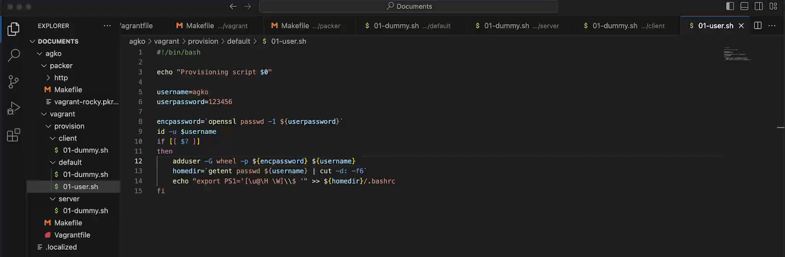
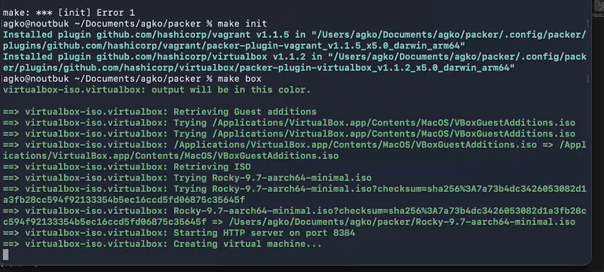
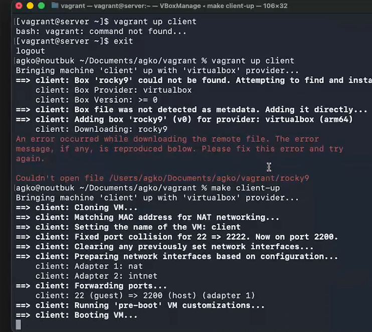
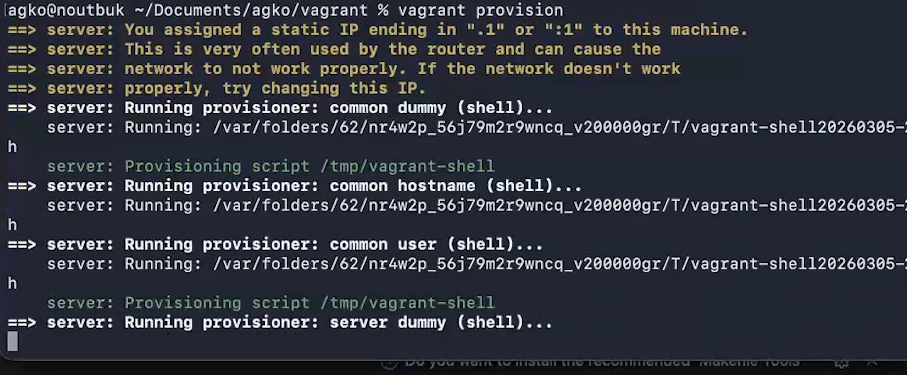

---
## Author
author:
  name: Ко Антон Геннадьевич
  degrees: DSc
  orcid: 0000-0002-0877-7063
  email: antonkosakh@gmail.com
  affiliation:
    - name: Российский университет дружбы народов
      country: Российская Федерация
      postal-code: 117198
      city: Москва
      address: ул. Миклухо-Маклая, д. 6
## Title
title: Структура научной презентации
subtitle: Простейший вариант
license: CC BY
date: today
date-format: "YYYY-MM-DD" # Example: 2025-09-06
---

# Информация

## Докладчик

:::::::::::::: {.columns align=center}
::: {.column width="70%"}

  * Ко Антон Геннадьевич
  * студент
  * Российский университет дружбы народов им. П. Лумумбы
  * [1132221551@rudn.ru](mailto:1132221551@rudn.ru)
  * <https://SenDerMen04.github.io/ru/>

:::
::: {.column width="30%"}


:::
::::::::::::::

# Вводная часть

## Цель работы

Целью данной работы является приобретение практических навыков установки Rocky Linux на виртуальную машину с помощью инструмента Vagrant.

## Задание

1. Сформируйте box-файл с дистрибутивом Rocky Linux для VirtualBox.
2. Запустите виртуальные машины сервера и клиента и убедитесь в их работоспособности.
3. Внесите изменения в настройки загрузки образов виртуальных машин server и client, добавив пользователя с правами администратора и изменив названия хостов.
4. Скопируйте необходимые для работы с Vagrant файлы и box-файлы виртуальных машин на внешний носитель. Используя эти файлы, вы можете попробовать развернуть виртуальные машины на другом компьютере.

# Выполнение лабораторной работы

## Конфигурационные файлы

```
mkdir -p /var/tmp/user_name/packer
mkdir -p /var/tmp/user_name/vagran
```

Файлы: vagrant-rocky.pkr.hc, ks.cfg, Vagrantfile, Makefile. 

## Конфигурационные файлы

В каталогах default, server и client разместим скриптзаглушку 01-dummy.sh

```
#!/bin/bash
echo "Provisioning script $0"
```

## Конфигурационные файлы

В каталоге default разместим заранее подготовленный скрипт 01-user.sh по изменению названия виртуальной машины:

{#fig:001 width=70%}

## Конфигурационные файлы

В каталоге default разместим заранее подготовленный скрипт 01-hostname.sh по изменению названия виртуальной машины:

{#fig:002 width=70%}

## Развёртывание лабораторного стенда на ОС Linux

Перейдем в каталог с проектом:
```
cd /var/tmp/user_name/packer
```
В терминале наберем
```
makе help
```

## Развёртывание лабораторного стенда на ОС Linux

{#fig:003 width=70%}

## Развёртывание лабораторного стенда на ОС Linux

{#fig:004 width=70%}

## Развёртывание лабораторного стенда на ОС Linux

{#fig:005 width=70%}

## Развёртывание лабораторного стенда на ОС Linux

{#fig:006 width=70%}

## Внесение изменений в настройки внутреннего окружения виртуальной машины

{#fig:007 width=70%}

# Заключение

## Выводы

В результате выполнения данной работы были приобретены практические навыки установки Rocky Linux на виртуальную машину с помощью инструмента Vagrant.