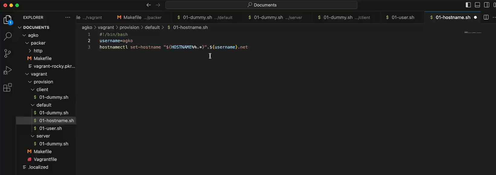
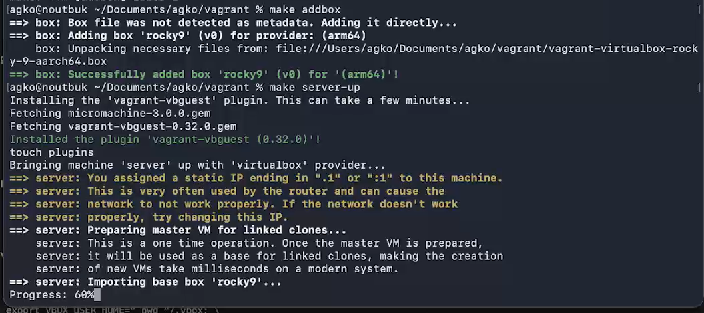

---
## Author
author:
  name: Ко Антон Геннадьевич
  degrees: DSc
  orcid: 0000-0002-0877-7063
  email: antonkosakh@gmail.com
  affiliation:
    - name: Российский университет дружбы народов
      country: Российская Федерация
      postal-code: 117198
      city: Москва
      address: ул. Миклухо-Маклая, д. 6

## Title
title: "Лабораторная работа №1"
subtitle: "Подготовка лабораторного стенда"
license: "CC BY"
---


# Цель работы

Целью данной работы является приобретение практических навыков установки Rocky Linux на виртуальную машину с помощью инструмента Vagrant.

# Задание

1. Сформируйте box-файл с дистрибутивом Rocky Linux для VirtualBox
2. Запустите виртуальные машины сервера и клиента и убедитесь в их работоспособности.
3. Внесите изменения в настройки загрузки образов виртуальных машин server и client, добавив пользователя с правами администратора и изменив названия хостов 
4. Скопируйте необходимые для работы с Vagrant файлы и box-файлы виртуальных машин на внешний носитель. Используя эти файлы, вы можете попробовать развернуть виртуальные машины на другом компьютере.

# Выполнение лабораторной работы

Перед началом работы с Vagrant создадим каталог в /var/tmp с помощью команд:

```
mkdir -p /var/tmp/user_name/packer
mkdir -p /var/tmp/user_name/vagran
```
В созданном рабочем каталоге разместим образ варианта операционной системы Rocky Linux и в этом же каталоге разместим подготовленные заранее для работы с Vagrant файлы: vagrant-rocky.pkr.hc, ks.cfg, Vagrantfile, Makefile. 

В этом же каталоге создадим каталог provision с подкаталогами default, server
и client, в которых будут размещаться скрипты, изменяющие настройки внутреннего окружения базового (общего) образа виртуальной машины, сервера или клиента соответственно.
В каталогах default, server и client разместим заранее подготовленный скриптзаглушку 01-dummy.sh следующего содержания:

```
#!/bin/bash
echo "Provisioning script $0"
```
В каталоге default разместим заранее подготовленный скрипт 01-user.sh по изменению названия виртуальной машины следующего содержания(рис. #fig:001):

{#fig:001 width=70%}

В каталоге default разместим заранее подготовленный скрипт 01-hostname.sh по изменению названия виртуальной машины следующего содержания(рис. #fig:002):

{#fig:002 width=70%}

Перейдем в каталог с проектом:
```
cd /var/tmp/user_name/packer
```
В терминале наберем
```
makе help
```
Посмотрим перечень указанных в Makefile целей и краткое описание их действий.

Для формирования box-файла с дистрибутивом Rocky Linux для VirtualBox в терминале наберем `make`(рис. #fig:003):

{#fig:003 width=70%}

Начался процесс скачивания, распаковки и установки драйверов VirtualBox и дистрибутива ОС на виртуальную машину.

После завершения процесса автоматического развёртывания образа виртуальной машины в каталоге /var/tmp/user_name/vagrant временно появился каталог builds с промежуточными файлами .vdi, .vmdk и .ovf, которые затем автоматически будут преобразованы в box-файл сформированного образа.

Для регистрации образа виртуальной машины в Vagrant в терминале в каталоге /var/tmp/user_name/vagrant наберем `make addbox`(рис. #fig:004):

{#fig:004 width=70%}

Это позволит на основе конфигурации, прописанной в файле Vagrantfile, сформировать box-файлы образов двух виртуальных машин — сервера и клиента с возможностью их параллельной или индивидуальной работы.

Запустим виртуальную машину Server, введя `make server-up`(рис. #fig:005, #fig:006):

{#fig:005 width=70%}

Запустим виртуальную машину Client, введя `make client-up`(рис. #fig:006):

{#fig:006 width=70%}

Затем выключим обе виртуальные машины и внесем изменения в настройки внутреннего окружения виртуальной машины.

Зафиксируем внесённые изменения для внутренних настроек виртуальных машин, введя в терминале `vagrant provision` (рис. #fig:007):

{#fig:007 width=70%}

# Контрольные вопросы

1. Для чего предназначен Vagrant?
Vagrant — представляет собой инструмент для создания и управления средами виртуальных машин в одном рабочем процессе.
Этот инструмент предназначен для автоматизации процесса установки на виртуальную машину как основного дистрибутива операционной системы, так и настройки необходимого в дальнейшем программного обеспечения.

2. Что такое box-файл? В чём назначение Vagrantfile?

box-файл (или Vagrant Box) — сохранённый образ виртуальной машины с развёрнутой в ней операционной системой; по сути, box-файл используется как основа для клонирования виртуальных машин с теми или иными настройками.

Vagrantfile — конфигурационный файл, написанный на языке Ruby, в котором указаны настройки запуска виртуальной машины.


3. Приведите описание и примеры вызова основных команд Vagrant.

С Vagrant можно работать, используя следующие основные команды:

– vagrant help — вызов справки по командам Vagrant;
– vagrant box list — список подключённых к Vagrant box-файлов;
– vagrant box add — подключение box-файла к Vagrant;
– vagrant destroy — отключение box-файла от Vagrant и удаление его из виртуального
окружения;
– vagrant init — создание «шаблонного» конфигурационного файла
Vagrantfile для его последующего изменения;
– vagrant up — запуск виртуальной машины с использованием инструкций по запуску
из конфигурационного файла Vagrantfile;
– vagrant reload — перезагрузка виртуальной машины;
– vagrant halt — остановка и выключение виртуальной машины;
– vagrant provision — настройка внутреннего окружения имеющейся виртуальной
машины (например, добавление новых инструкций (скриптов) в ранее созданную
виртуальную машину);
– vagrant ssh — подключение к виртуальной машине через ssh

4. Дайте построчные пояснения содержания файлов vagrant-rocky.pkr.hcl, ks.cfg,
Vagrantfile, Makefile.

vagrant-rocky.pkr.hcl — специальный файл с описанием метаданных по установке дистрибутива на виртуальную машину. в частности, в разделе переменных этот файл содержит указание на версию дистрибутива, его хэш-функцию, имя и пароль пользователя по умолчанию; в разделе builders указаны специальные синтаксические конструкции для автоматизации работы VirtualBox; в разделе provisioners прописаны действия (по сути shell-скрипт) по установке дополнительных пакетов дистрибутива

ks.cfg — определяет настройки для установки дистрибутива, которые пользователь обычно вводит вручную, в частности настройки языка интерфейса, языковые настройки клавиатуры, тайм-зону, сетевые настройки и т.п.; файл должен быть расположен в подкаталоге http/

Vagrantfile — файл с конфигурацией запуска виртуальных машин — сервера
и клиента.

Makefile — набор инструкций для программы make по работе с Vagrant

# Выводы

В результате выполнения данной работы были приобретены практические навыки установки Rocky Linux на виртуальную машину с помощью инструмента Vagrant.

