---
## Author
author:
  name: Ко Антон Геннадьевич
  degrees: DSc
  orcid: 0000-0002-0877-7063
  email: antonkosakh@gmail.com
  affiliation:
    - name: Российский университет дружбы народов
      country: Российская Федерация
      postal-code: 117198
      city: Москва
      address: ул. Миклухо-Маклая, д. 6
## Title
title: Лабораторная работа №2
subtitle: Настройка DNS-сервера
license: CC BY
date: today
date-format: "YYYY-MM-DD" # Example: 2026-03-08
---

# Вводная часть

## Цель работы

Приобретение практических навыков по установке и конфигурированию DNS-сервера, усвоение принципов работы системы доменных имён.

## Задание

1. Установите на виртуальной машине server DNS-сервер bind и bind-utils.
2. Сконфигурируйте на виртуальной машине server кэширующий DNS-сервер.
3. Сконфигурируйте на виртуальной машине server первичный DNS-сервер.
4. При помощи утилит dig и host проанализируйте работу DNS-сервера.
5. Напишите скрипт для Vagrant, фиксирующий действия по установке и конфигурированию DNS-сервера во внутреннем окружении виртуальной машины server. Соответствующим образом внесите изменения в Vagrantfile

# Выполнение лабораторной работы

## Установка DNS-сервера

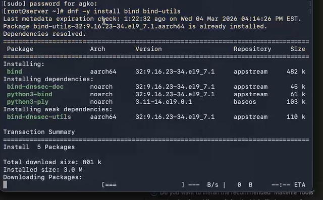{#fig:001 width=70%}

## Установка DNS-сервера

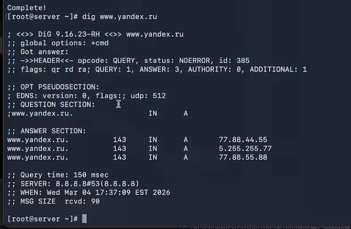{#fig:002 width=70%}

## Конфигурирование кэширующего DNS-сервера

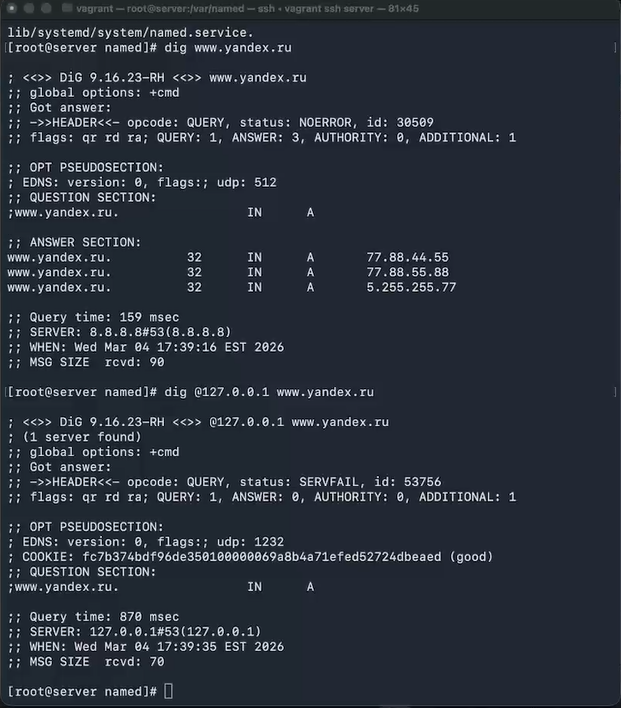{#fig:003 width=70%}

## Конфигурирование кэширующего DNS-сервера

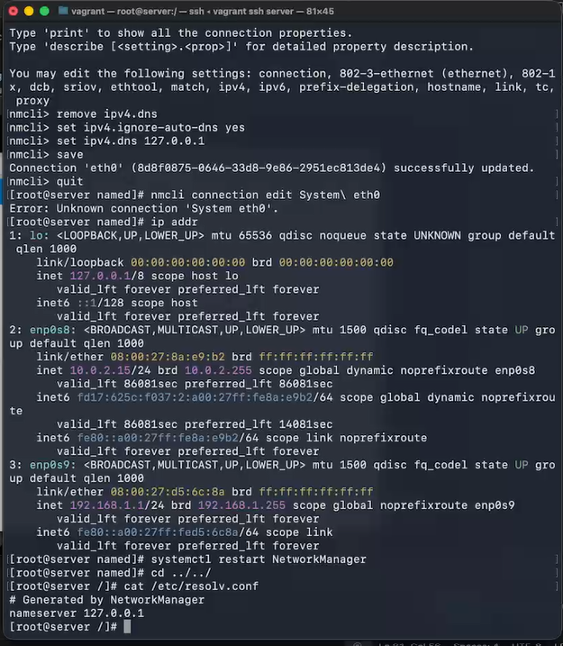{#fig:004 width=70%}

## Конфигурирование кэширующего DNS-сервера

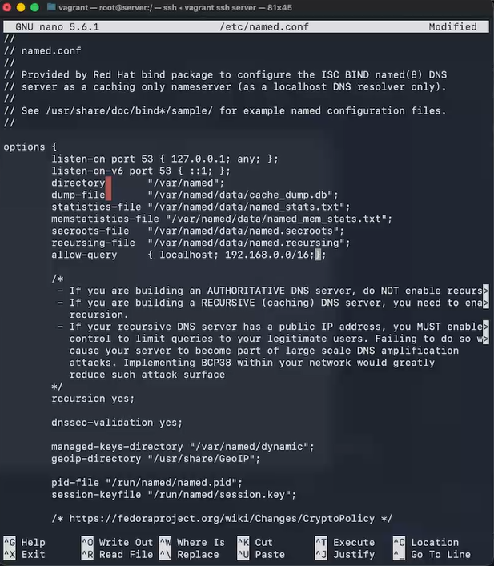{#fig:005 width=70%}

## Конфигурирование кэширующего DNS-сервера

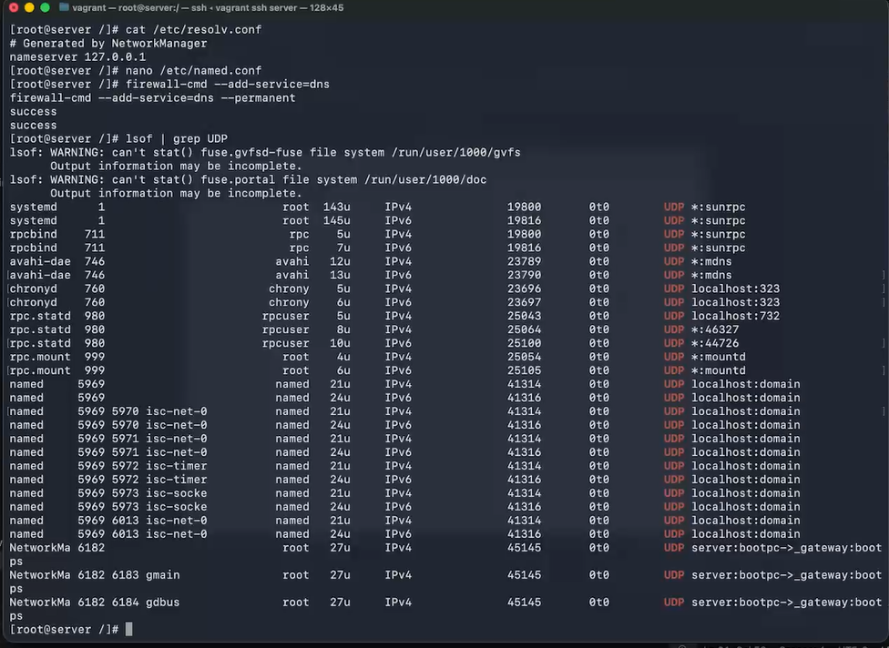{#fig:006 width=70%}

## Конфигурирование кэширующего DNS-сервера при наличии фильтрации DNS-запросов маршрутизаторами

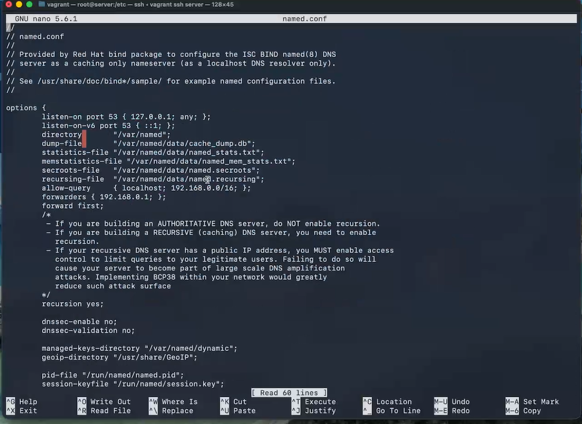{#fig:007 width=55%}

## Конфигурирование первичного DNS-сервера

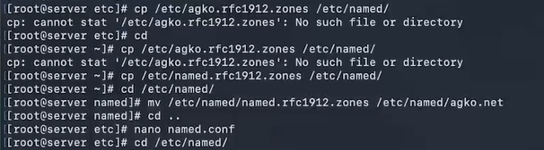{#fig:008 width=70%}

## Конфигурирование первичного DNS-сервера

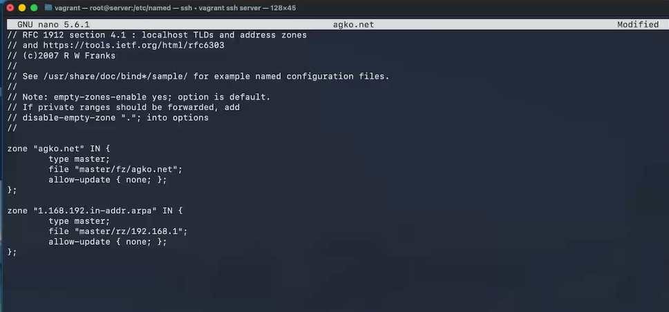{#fig:009 width=70%}

## Конфигурирование первичного DNS-сервера

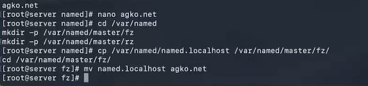{#fig:010 width=70%}

## Конфигурирование первичного DNS-сервера

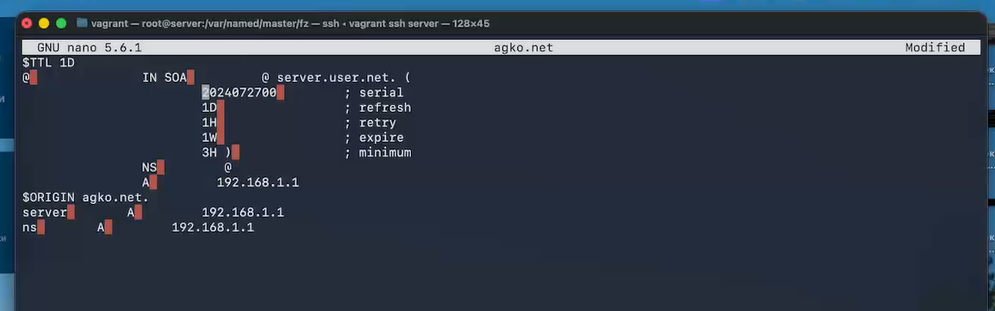{#fig:011 width=70%}

## Конфигурирование первичного DNS-сервера

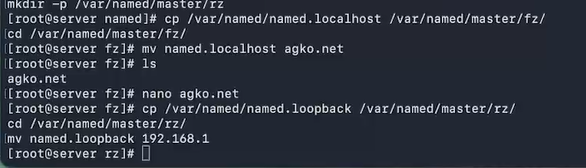{#fig:012 width=70%}

## Конфигурирование первичного DNS-сервера

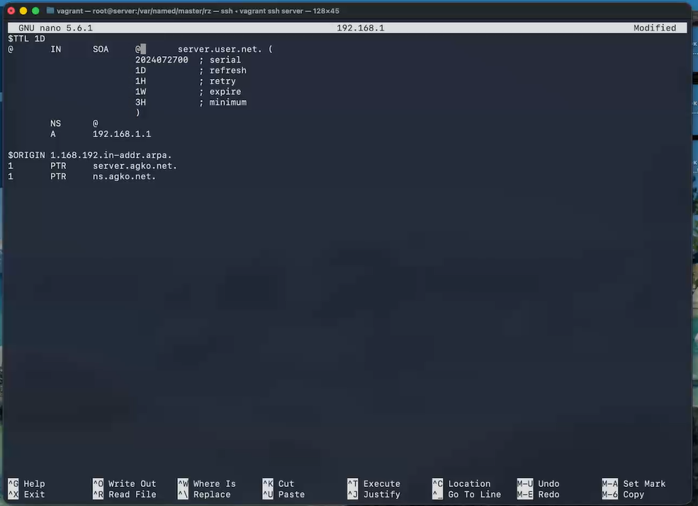{#fig:013 width=70%}

## Конфигурирование первичного DNS-сервера

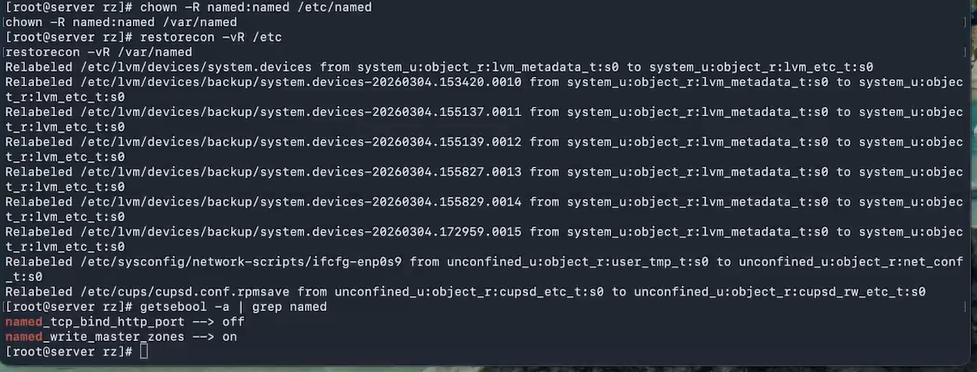{#fig:014 width=70%}

## Конфигурирование первичного DNS-сервера

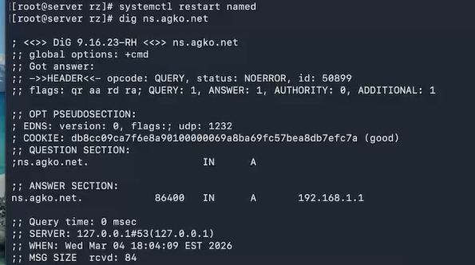{#fig:015 width=70%}

## Анализ работы DNS-сервера

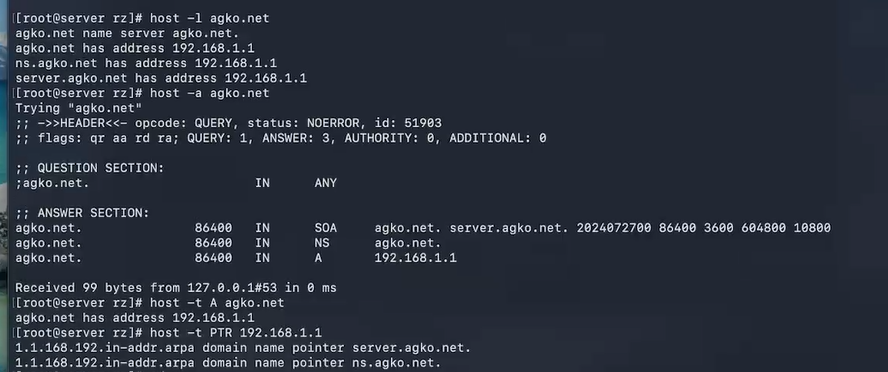{#fig:016 width=70%}

## Анализ работы DNS-сервера

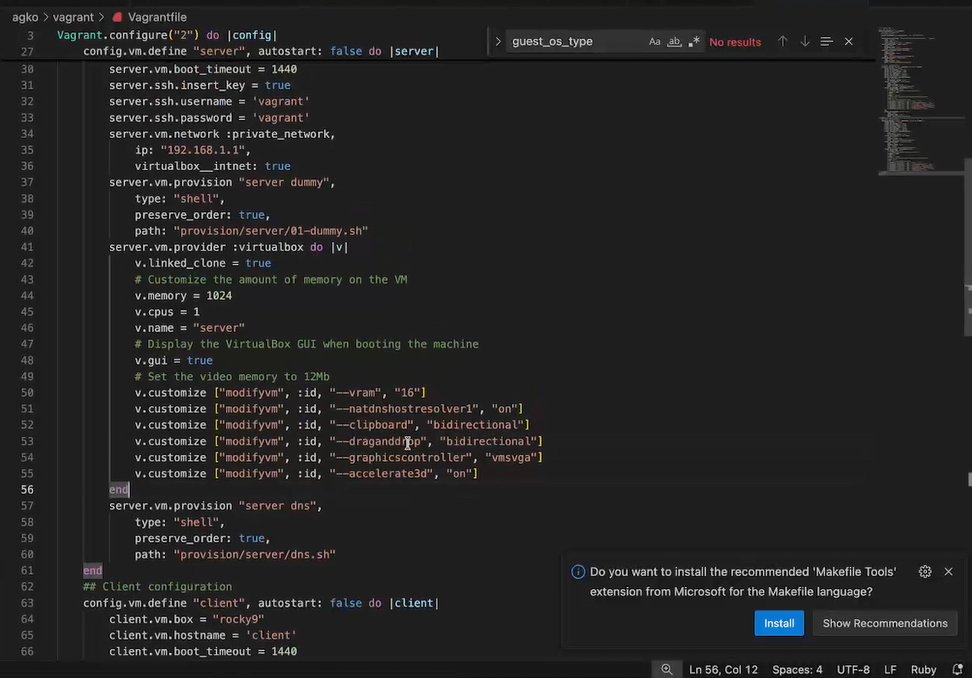{#fig:017 width=70%}

## Внесение изменений в настройки внутреннего окружения виртуальной машины

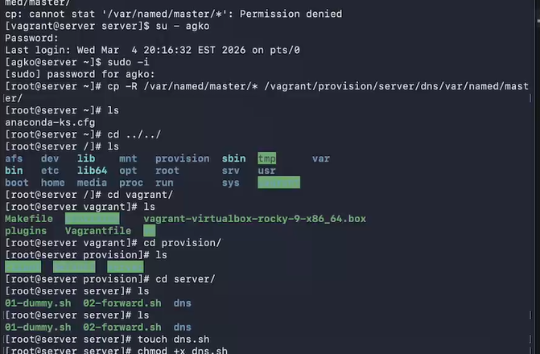{#fig:018 width=70%}

## Внесение изменений в настройки внутреннего окружения виртуальной машины

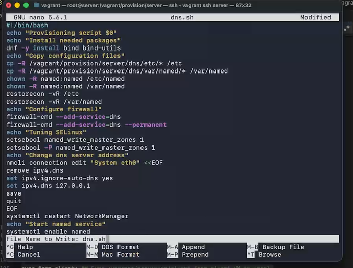{#fig:019 width=70%}

## Внесение изменений в настройки внутреннего окружения виртуальной машины

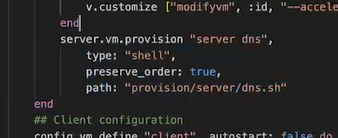{#fig:020 width=70%}

# Заключение

## Выводы

В результате выполнения данной работы были приобретены практические навыки по установке и конфигурированию DNS-сервера, усвоение принципов работы системы доменных имён.