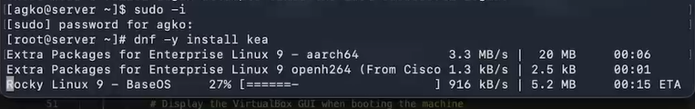
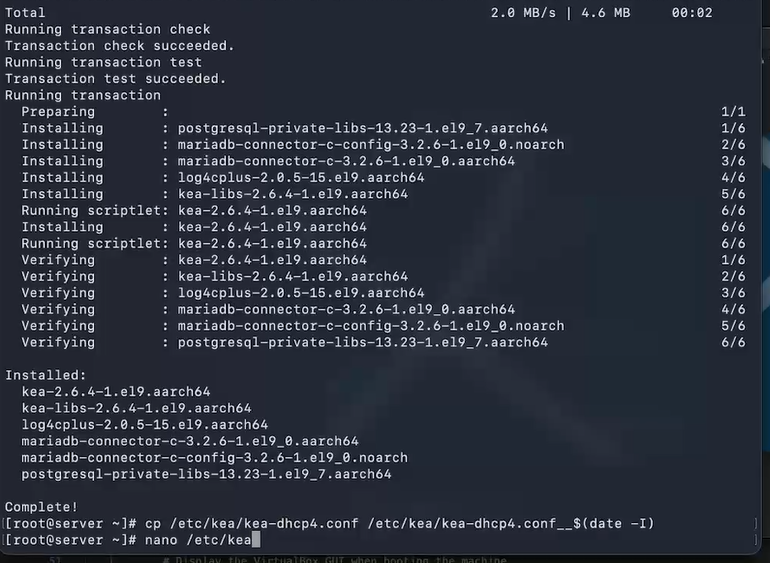
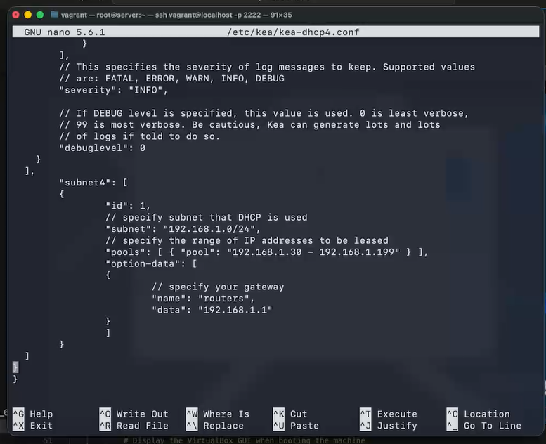
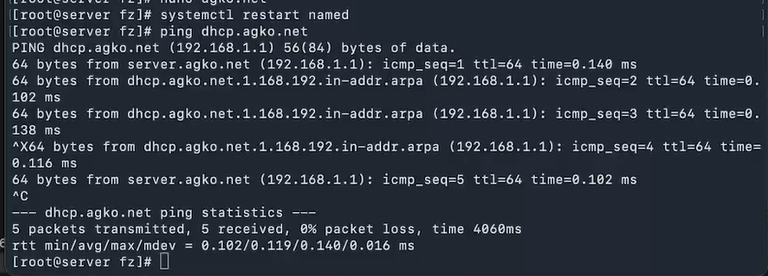
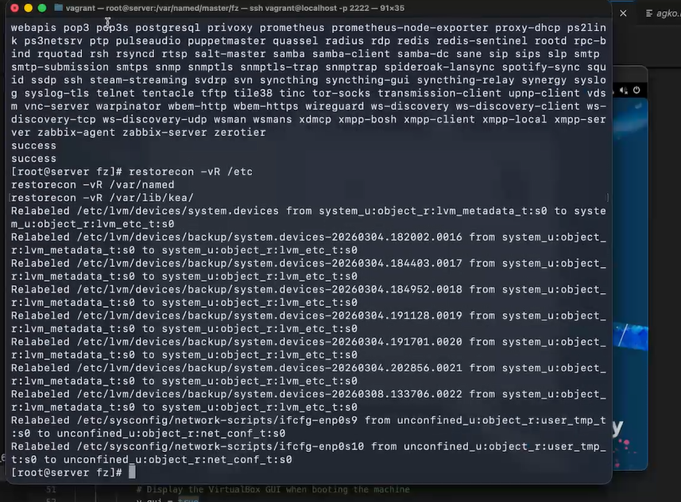
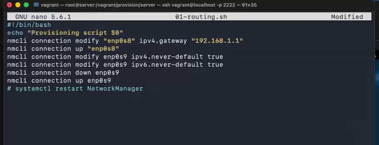
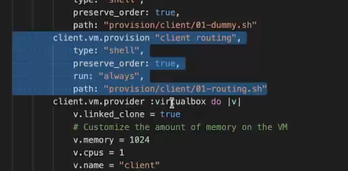

---
## Author
author:
  name: Ко Антон Геннадьевич
  degrees: DSc
  orcid: 0000-0002-0877-7063
  email: antonkosakh@gmail.com
  affiliation:
    - name: Российский университет дружбы народов
      country: Российская Федерация
      postal-code: 117198
      city: Москва
      address: ул. Миклухо-Маклая, д. 6
## Title
title: Лабораторная работа №3
subtitle: Настройка DHCP-сервера
license: CC BY
date: today
date-format: "YYYY-MM-DD" # Example: 2026-03-08
---

# Информация

## Докладчик

:::::::::::::: {.columns align=center}
::: {.column width="70%"}

  * Ко Антон Геннадьевич
  * студент
  * Российский университет дружбы народов им. П. Лумумбы
  * [1132221551@rudn.ru](mailto:1132221551@rudn.ru)
  * <https://SenDerMen04.github.io/ru/>

:::
::: {.column width="30%"}


:::
::::::::::::::

# Вводная часть

## Цель работы

Приобретение практических навыков по установке и конфигурированию DHCP-сервера.

## Задание

1. Установите на виртуальной машине server DHCP-сервер.
2. Настройте виртуальную машину server в качестве DHCP-сервера для виртуальной внутренней сети.
3. Проверьте корректность работы DHCP-сервера в виртуальной внутренней сети путём запуска виртуальной машины client и применения соответствующих утилит диагностики.
4. Настройте обновление DNS-зоны при появлении в виртуальной внутренней сети новых узлов.
5. Проверьте корректность работы DHCP-сервера и обновления DNS-зоны в виртуальной
внутренней сети путём запуска виртуальной машины client и применения соответствующих утилит диагностики.
6. Напишите скрипт для Vagrant, фиксирующий действия по установке и настройке DHCP-сервера во внутреннем окружении виртуальной машины server. Соответствующим Ыобразом внести изменения в Vagrantfile.

# Выполнение лабораторной работы

## Установка DHCP-сервера

{#fig:001 width=70%}

## Конфигурирование DHCP-сервера

{#fig:002 width=70%}

## Конфигурирование DHCP-сервера

{#fig:003 width=60%}

## Конфигурирование DHCP-сервера

{#fig:004 width=60%}

## Конфигурирование DHCP-сервера

{#fig:005 width=60%}

## Конфигурирование DHCP-сервера

{#fig:006 width=55%}

## Конфигурирование DHCP-сервера

{#fig:007 width=70%}

## Анализ работы DHCP-сервера

```
cd /var/tmp/user_name/vagrant/provision/client
touch 01-routing.sh
chmod +x 01-routing.sh
```

## Анализ работы DHCP-сервера

{#fig:008 width=70%}

## Анализ работы DHCP-сервера

{#fig:009 width=70%}

## Анализ работы DHCP-сервера

```
make client-provision
```

## Анализ работы DHCP-сервера

{#fig:010 width=50%}

Также информацию о работе DHCP-сервера можно наблюдать в файле /var/lib/dhcpd/dhcpd.leases.

## Анализ работы DHCP-сервера

{#fig:011 width=60%}

## Настройка обновления DNS-зоны

{#fig:012 width=50%}

## Настройка обновления DNS-зоны

Затем перезапустим  DNS-сервер командой:

```
systemctl restart named
```
## Настройка обновления DNS-зоны

{#fig:013 width=70%}

## Анализ работы DHCP-сервера после настройки обновления DNS-зоны

С помощью утилиты dig убедимся в наличии DNS-записи о клиенте в прямой DNS-зоне:

```
dig @192.168.1.1 client.agko.net
```

## Внесение изменений в настройки внутреннего окружения виртуальной машины

Запишем в dhcp.sh следующий скрипт:

{#fig:014 width=70%}

## Внесение изменений в настройки внутреннего окружения виртуальной машины

{#fig:015 width=50%}

# Заключение

## Выводы

В результате выполнения данной работы были приобретены практические навыки по установке и конфигурированию DHCP-сервера.