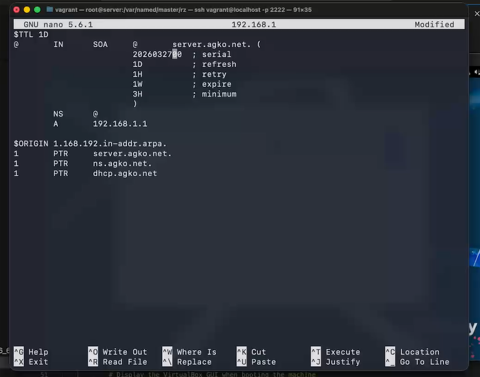
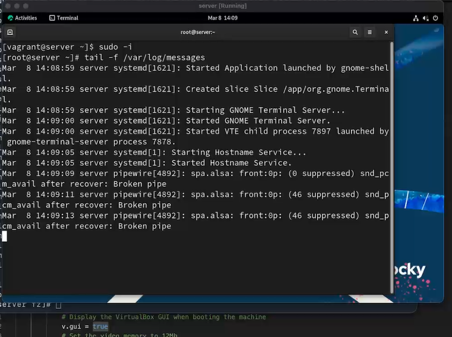
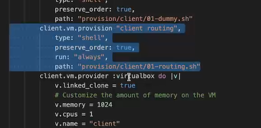
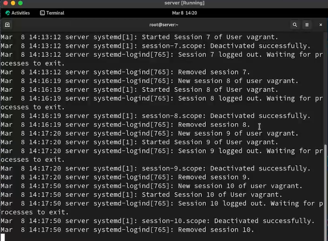
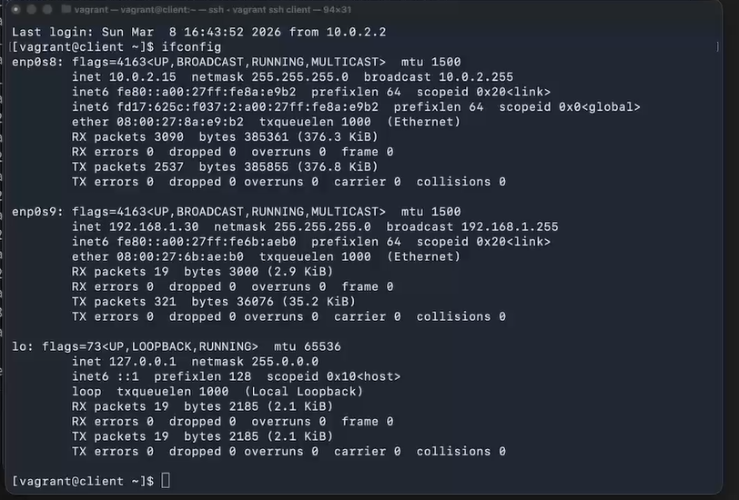
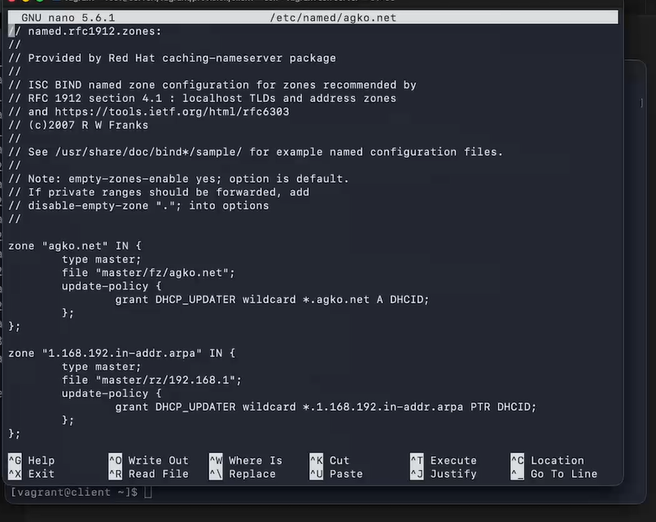
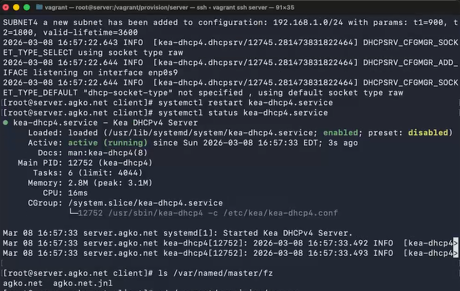
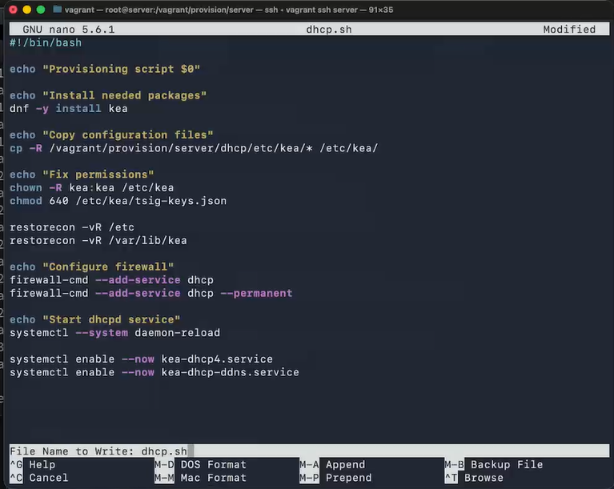
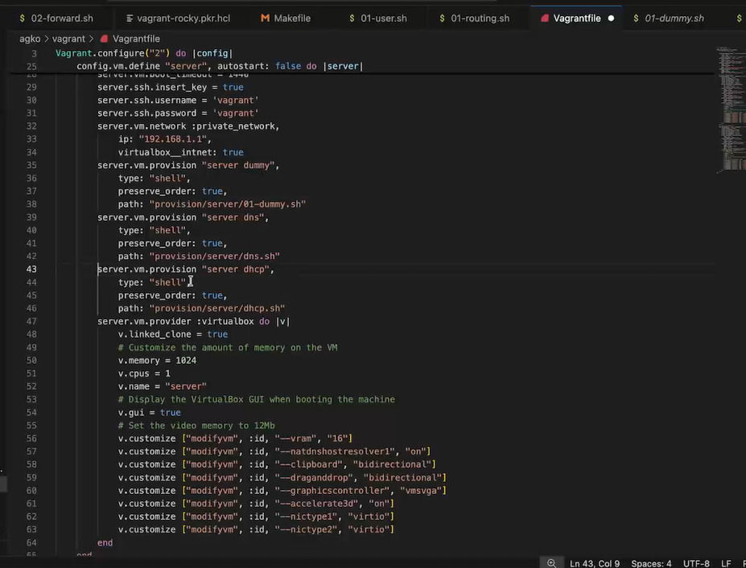

---
## Author
author:
  name: Ко Антон Геннадьевич
  degrees: DSc
  orcid: 0000-0002-0877-7063
  email: antonkosakh@gmail.com
  affiliation:
    - name: Российский университет дружбы народов
      country: Российская Федерация
      postal-code: 117198
      city: Москва
      address: ул. Миклухо-Маклая, д. 6

## Title
title: "Лабораторная работа №3"
subtitle: "Настройка DHCP-сервера"
license: "CC BY"
---

# Цель работы

Приобретение практических навыков по установке и конфигурированию DHCP-сервера.

# Задание

1. Установите на виртуальной машине server DHCP-сервер.
2. Настройте виртуальную машину server в качестве DHCP-сервера для виртуальной внутренней сети.
3. Проверьте корректность работы DHCP-сервера в виртуальной внутренней сети путём запуска виртуальной машины client и применения соответствующих утилит диагностики.
4. Настройте обновление DNS-зоны при появлении в виртуальной внутренней сети новых узлов.
5. Проверьте корректность работы DHCP-сервера и обновления DNS-зоны в виртуальной
внутренней сети путём запуска виртуальной машины client и применения соответствующих утилит диагностики.
6. Напишите скрипт для Vagrant, фиксирующий действия по установке и настройке DHCP-сервера во внутреннем окружении виртуальной машины server. Соответствующим Ыобразом внести изменения в Vagrantfile.

# Выполнение лабораторной работы

## Установка DHCP-сервера

Загрузим нашу операционную систему и перейдем в рабочий каталог с проектом:
```
cd /var/tmp/agko/vagran
```
Затем запустим виртуальную машину server:
```
make server-up
```

На виртуальной машине server войдем под созданным в предыдущей работе
пользователем и откроем терминал. Перейдем в режим суперпользователя и установим dhcp(рис. #fig:001):

{#fig:001 width=70%}


## Конфигурирование DHCP-сервера


Скопируем файл примера конфигурации DHCP dhcpd.conf.example из каталога /usr/share/doc/dhcp* в каталог/etc/dhcp и переименуем его в файл с названием dhcpd.conf(рис. #fig:002):

{#fig:002 width=70%}

Откроем файл /etc/dhcp/dhcpd.conf на редактирование. В этом файле изменим содержимое(рис. #fig:003):

{#fig:003 width=70%}

При указании опрашиваемого адреса в строке с адресом сервера написан адрес, который указывали, также указаны куки. Время запроса увеличивается.

Настроим привязку dhcpd к интерфейсу eth1 виртуальной машины server. Для этого скопируем файл dhcpd.service из каталога /lib/systemd/system в каталог
/etc/systemd/system с помощью команды cp.

Откроем файл /etc/systemd/system/dhcpd.service на редактирование и замените в нём строку:

Перезагрузим конфигурацию dhcpd и разрешим загрузку DHCP-сервера при запуске виртуальной машины server, добавим запись для DHCP-сервера в конце файла прямой DNS-зоны
/var/named/master/fz/user.net и в конце файла обратной зоны /var/named/master/rz/192.168.1, а также в обоих файлах изменим дату(#fig:004):

{#fig:004 width=70%}

Перезапустим named и проверим, можно ли обратиться к DHCP-серверу по имени(#fig:005):

{#fig:005 width=70%}

Обращение по имени было успешно произведено.

Внесем изменения в настройки межсетевого экрана узла server, разрешив работу
с DHCP и восстановим контекст безопасности SELinux(рис. #fig:006):

{#fig:006 width=70%}

В дополнительном терминале запустим мониторинг происходящих в системе процессов в реальном времени(рис. #fig:007):

{#fig:007 width=70%}

В основном рабочем терминале запустим DHCP-сервер.

## Анализ работы DHCP-сервера

Перед запуском виртуальной машины client в каталоге с проектом в основной операционной системе в подкаталоге vagrant/provision/client создадим файл 01-routing.sh:
```
cd /var/tmp/user_name/vagrant/provision/client
touch 01-routing.sh
chmod +x 01-routing.sh
```

Открыв его на редактирование, пропишем в нём следующий скрипть(рис. #fig:008):

{#fig:008 width=70%}

В Vagrantfile подключим этот скрипт в разделе конфигурации для клиента(рис. #fig:009):

{#fig:009 width=70%}

Зафиксируем внесённые изменения для внутренних настроек виртуальной машины client и запустим её, введя в терминале:
```
make client-provision
```

После загрузки виртуальной машины client можно увидеть на виртуальной машине server на терминале с мониторингом происходящих в системе процессов записи о подключении к виртуальной внутренней сети узла client и выдачи ему IP-адреса из соответствующего диапазона адресов(рис. #fig:010)

{#fig:010 width=70%}

Также информацию о работе DHCP-сервера можно наблюдать в файле /var/lib/dhcpd/dhcpd.leases:

```
# The format of this file is documented in the dhcpd.leases(5) manual page.
# This lease file was written by isc-dhcp-4.4.2b1

# authoring-byte-order entry is generated, DO NOT DELETE
authoring-byte-order little-endian;

server-duid "\000\001\000\001,\343\2662\010\000'\347\005\032";

\\ Указана информация о зарезервированном адресе 192.168.1.30

lease 192.168.1.30 { 
  starts 0 2026/03/08 23:49:15; \\ время и дата начала резерва 
  ends 0 2026/03/08 23:59:15; \\ время и дата конца резерва
  cltt 0 2026/03/08 23:49:15; \\ время последнего действия клиента
  binding state active; \\ состояние привязки активно
  next binding state free; \\ состояние привязки перейдет в свободное, когда истечет срок аренды
  rewind binding state free; \\состояние, используемое при аварином переключении
  hardware ethernet 08:00:27:23:cc:66; \\ MAC-адрес оборудования
  uid "\001\010\000'#\314f"; \\ идентификатор клиента, используемый клиентом для получения аренды
  client-hostname "client"; \\ имя хоста клиента
}

```

Войдем в систему виртуальной машины client и откроем терминал. В терминале введем `ifconfig`. На экран выведелась информация об имеющихся интерфейсах(#fig:011):

{#fig:011 width=70%}

Можно увидеть, что была выведена информация о трёх сетевых интерфейсах: eth0, eth1 и локальный(lo). О каждом интерфесе вывелся одинаковый набор информации, разберем построчно на примере eth1:
```
eth1: flags=4163<UP,BROADCAST,RUNNING,MULTICAST>  mtu 1500
        inet 192.168.1.30  netmask 255.255.255.0  broadcast 192.168.1.255 \\ ip-адрес версии 4, маска сети и широковещательный адрес
        inet6 fe80::a00:27ff:fe23:cc66  prefixlen 64  scopeid 0x20<link> \\ ip-адрес версии 6, префикс сети и область dhcp, которой принадлежит адрес
        ether 08:00:27:23:cc:66  txqueuelen 1000  (Ethernet) \\MAC-адрес сетевого оборудования
        RX packets 18  bytes 3054 (2.9 KiB) \\ количество и размер отправленных пакетов
        RX errors 0  dropped 0  overruns 0  frame 0 \\ количество ошибок, сброшенных и превышающих время отправленных пакетов
        TX packets 317  bytes 33002 (32.2 KiB) \\  количество и размер полученных пакетов
        TX errors 0  dropped 0 overruns 0  carrier 0  collisions 0 \\ количество ошибок, сброшенных, превысящих время пакетов. а также несущих и коллизий

``` 

## Настройка обновления DNS-зоны

На виртуальной машине server под пользователем с правами суперпользователя отредактируем файл /etc/named/agko.net, разрешив обновление зоны с локального адреса, т.е. заменив в этом файле в строке allow-update слово none на 127.0.0.1:(#fig:012):

{#fig:012 width=70%}

Затем перезапустим  DNS-сервер командой:
```
systemctl restart named
```
Внесем изменения в конфигурационный файл, добавив в него разрешение на динамическое обновление DNS-записей с локального узла прямой и обратной зон. Затем перезапустим  DNS-сервер. Перезапуск DHCP-сервера прошёл успешно, в каталоге прямой DNS-зоны /var/named/master/fz должен появился файл agko.net.jnl, в котором в бинарном файле автоматически вносятся изменения записей зоны(#fig:013):

{#fig:013 width=70%}

## Анализ работы DHCP-сервера после настройки обновления DNS-зоны

На виртуальной машине client откроем терминал и с помощью утилиты dig убедимся в наличии DNS-записи о клиенте в прямой DNS-зоне:
```
dig @192.168.1.1 client.agko.net
```
Вывелась следующая информация:

```
; <<>> DiG 9.16.23-RH <<>> @192.168.1.1 client.agko.net \\ версия DIG
; (1 server found) \\ найден один сервер
;; global options: +cmd \\глобальная опция, говорящая, что нужно отображать
                        \\ аргументы при анализе
;; Got answer: \\ ответ получен
;; ->>HEADER<<- opcode: QUERY, status: NOERROR, id: 61619 \\ код операции --
                                   \\запрос, ошибок нет, ID процесса 61619
;; flags: qr aa rd ra; QUERY: 1, ANSWER: 1, AUTHORITY: 0, ADDITIONAL: 1
\\ указаны флаги qr(указывающий, что мы производим запрос), 
\\rd(рекурсия желательна),aa (ответ авторитетный). 
\\ra(указывает, что сервер поддерживает рекурсивный запрос)

;; OPT PSEUDOSECTION: \\псевдосекция
; EDNS: version: 0, flags:; udp: 1232 \\версия EDNS флаги и
                                   \\ размер UDP пакета
; COOKIE: a8ce51bda0ead2e101000000655112aac7f304ea8831b8d9 (good) \\ куки
;; QUESTION SECTION: \\ полученные ответы
;client.agko.net.		IN	A \\ А - ip-адреса версии 4

;; ANSWER SECTION: \\ответ
client.agko.net.	300	IN	A	192.168.1.30  \\ ip-адрес версии 4

;; Query time: 4 msec \\ время запроса
;; SERVER: 192.168.1.1#53(192.168.1.1) \\адрес сервера
;; WHEN: Sun Mar 08 23:55:10 UTC 2026 \\дата
;; MSG SIZE  rcvd: 94 \\ размер сообщения

```

## Внесение изменений в настройки внутреннего окружения виртуальной машины

На виртуальной машине server перейдем в каталог для внесения изменений в настройки внутреннего окружения /vagrant/provision/server/, создадим в нём каталог dhcp, в который поместим в соответствующие подкаталоги конфигурационные файлы DHCP, заменим конфигурационные файлы DNS-сервера и в каталоге /vagrant/provision/server создадим исполняемый файл dhcp.sh:

Запишем в dhcp.sh следующий скрипт(#fig:014):

{#fig:014 width=70%}

Для отработки созданного скрипта во время загрузки виртуальной машины server в конфигурационном файле Vagrantfile добавим в разделе конфигурации для сервера(#fig:015):

{#fig:015 width=70%}

# Контрольные вопросы

1. В каких файлах хранятся настройки сетевых подключений?


Конфигурация сетевого интерфейса хранится в /etc/sysconfig/network-scripts в соответствующем файле с префиксом ifcfg (там же конфигурационные файлы других интерфейсов).

2. За что отвечает протокол DHCP?

Протокол DHCP (Dynamic Host Configuration Protocol) отвечает за автоматическую настройку IP-адресов и других сетевых параметров для устройств в сети.

3. Поясните принцип работы протокола DHCP. Какими сообщениями обмениваются клиент и сервер, используя протокол DHCP?

Протокол DHCP работает по принципу клиент-серверной модели. Когда клиент подключается к сети, он отправляет DHCP-запрос на сервер, запрашивая IP-адрес и другие сетевые настройки. Сервер DHCP выделяет IP-адрес из своего пула доступных адресов и отправляет его клиенту вместе с другими настройками в сообщении DHCP-ответа.

4. В каких файлах обычно находятся настройки DHCP-сервера? За что отвечает каждый
из файлов?

Настройки хранятся в файле dhcpd.conf, а именно конфигурация dhcp-сети(адрес подсети, диапазон адресов для распределения клиентам, адрес маршрутизатора и broadcast-адрес), также доменное имя и его серверы. В файле dhcpd.service прописана привязка dhcpd к интерфейсу. 


5. Что такое DDNS? Для чего применяется DDNS?

DDNS (Dynamic Domain Name System) – это система, которая позволяет автоматически обновлять записи DNS при изменении IP-адресов устройств в сети. DDNS обеспечивает привязку доменных имен к динамически изменяющимся IP-адресам, что позволяет обращаться к сетевым ресурсам по именам, не зависящим от их текущего IP-адреса.

6. Какую информацию можно получить, используя утилиту ifconfig? 

Утилита ifconfig позволяет получить информацию о сетевых интерфейсах на компьютере, включая IP-адреса, маски подсети, MAC-адреса и другие параметры. Например, команда "ifconfig" выводит информацию о всех активных сетевых интерфейсах, а команда "ifconfig eth0" показывает информацию о конкретном сетевом интерфейсе eth0


7. Какую информацию можно получить, используя утилиту ping?

Утилита ping используется для проверки доступности и измерения задержки (ping) до удаленного хоста с использованием ICMP (Internet Control Message Protocol)

# Выводы

В результате выполнения данной работы были приобретены практические навыки по установке и конфигурированию DHCP-сервера.

