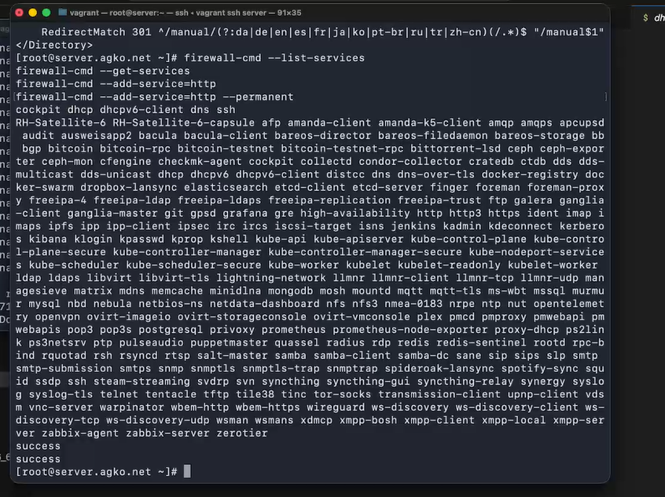
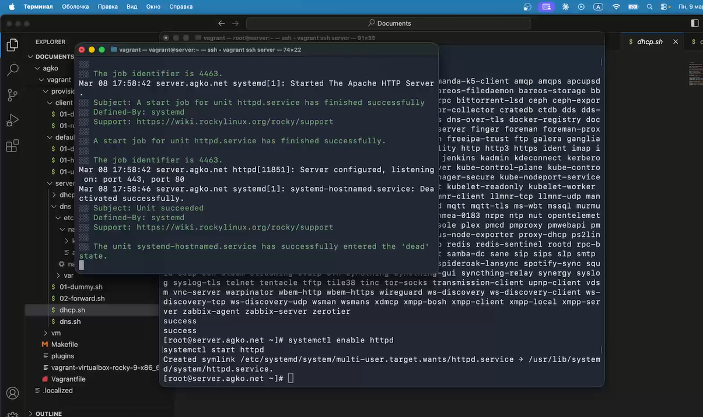
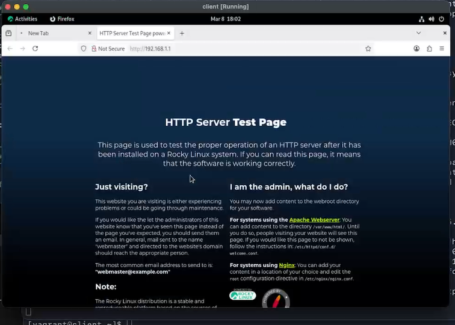
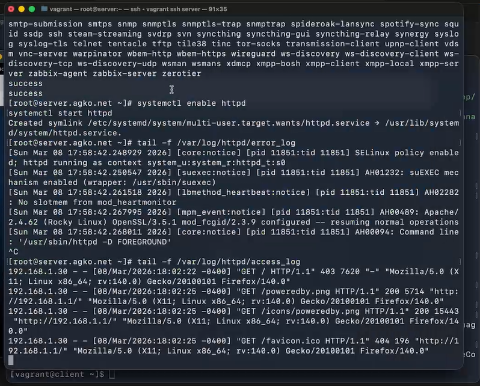
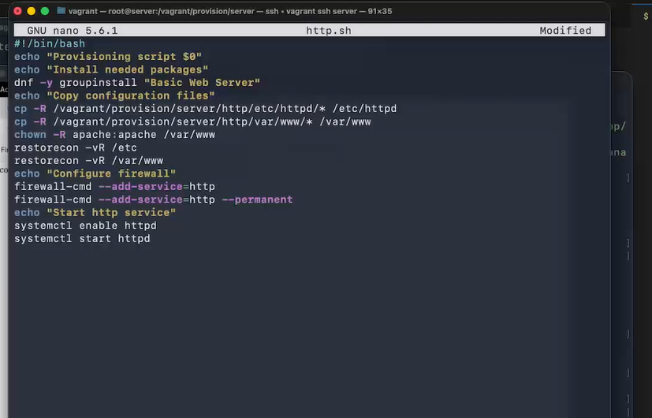

---
## Author
author:
  name: Ко Антон Геннадьевич
  degrees: DSc
  orcid: 0000-0002-0877-7063
  email: antonkosakh@gmail.com
  affiliation:
    - name: Российский университет дружбы народов
      country: Российская Федерация
      postal-code: 117198
      city: Москва
      address: ул. Миклухо-Маклая, д. 6
## Title
title: Лабораторная работа №1
subtitle: Подготовка лабораторного стенда
license: CC BY
date: today
date-format: "YYYY-MM-DD" # Example: 2026-03-08
---

# Информация

## Докладчик

:::::::::::::: {.columns align=center}
::: {.column width="70%"}

  * Ко Антон Геннадьевич
  * студент
  * Российский университет дружбы народов им. П. Лумумбы
  * [1132221551@rudn.ru](mailto:1132221551@rudn.ru)
  * <https://SenDerMen04.github.io/ru/>

:::
::: {.column width="30%"}


:::
::::::::::::::

# Вводная часть

## Цель работы

Приобретение практических навыков по установке и базовому конфигурированию HTTP-сервера Apache.

## Задание

1. Установите необходимые для работы HTTP-сервера пакеты.
2. Запустите HTTP-сервер с базовой конфигурацией и проанализируйте его работу.
3. Настройте виртуальный хостинг.
4. Напишите скрипт для Vagrant, фиксирующий действия по установке и настройке HTTP-сервера во внутреннем окружении виртуальной машины server. Соответствующим образом внесите изменения в Vagrantfile

# Выполнение лабораторной работы

## Установка HTTP-сервера

{#fig:001 width=50%}

## Базовое конфигурирование HTTP-сервера

{#fig:002 width=50%}

## Базовое конфигурирование HTTP-сервера

{#fig:003 width=50%}

## Анализ работы HTTP-сервера

{#fig:004 width=50%}

## Анализ работы HTTP-сервера

{#fig:005 width=50%}

## Настройка виртуального хостинга для HTTP-сервера

Запись для HTTP-сервера в конце файла прямой DNS-зоны /var/named/master/fz/agko.net:
```
server A 192.168.1.1
www A 192.168.1.1
```
Конец файла обратной зоны /var/named/master/rz/192.168.1:
```
1 PTR server.agko.net.
1 PTR www.agko.net.
```

## Настройка виртуального хостинга для HTTP-сервера

```
cd /etc/httpd/conf.d
touch server.agko.net.conf
touch www.agko.net.conf
```

## Настройка виртуального хостинга для HTTP-сервера

{#fig:006 width=70%}

## Настройка виртуального хостинга для HTTP-сервера

```
cd /var/www/html
mkdir server.agko.net
cd /var/www/html/server.agko.net
touch index.htm
```

## Настройка виртуального хостинга для HTTP-сервера

{#fig:007 width=70%}

## Настройка виртуального хостинга для HTTP-сервера

```
cd /var/www/html
mkdir www.agko.net
cd /var/www/html/www.agko.net
touch index.htm
```

## Настройка виртуального хостинга для HTTP-сервера

{#fig:008 width=70%}

## Настройка виртуального хостинга для HTTP-сервера

Копирование права доступа в каталог с веб-контентом командой:
```
chown -R apache:apache /var/www
```
Затем восстановим контекст безопасности:
```
restorecon -vR /etc
restorecon -vR /var/named
restorecon -vR /var/www
```
Перезапуск HTTP-сервера:  `systemctl restart httpd`

## Настройка виртуального хостинга для HTTP-сервера

{#fig:009 width=70%}

## Внесение изменений в настройки внутреннего окружения виртуальной машины

{#fig:010 width=60%}

## Внесение изменений в настройки внутреннего окружения виртуальной машины

{#fig:011 width=60%}

## Внесение изменений в настройки внутреннего окружения виртуальной машины

{#fig:012 width=70%}

# Заключение

## Выводы

В результате выполнения данной работы были приобретены практические навыки по установке и базовому конфигурированию HTTP-сервера Apache.