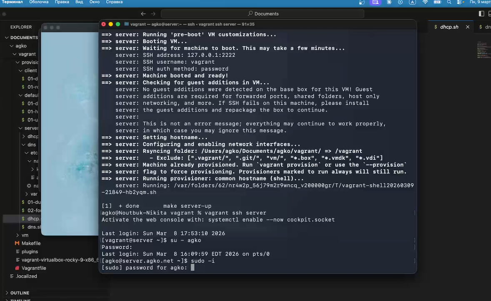
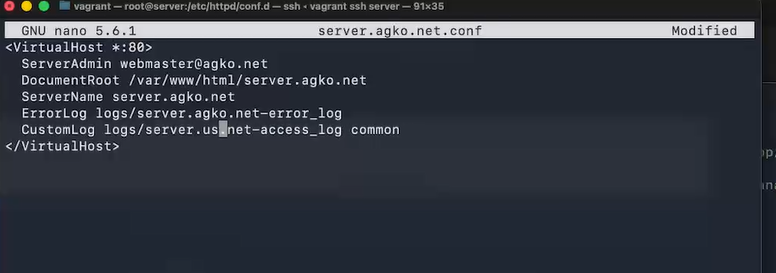
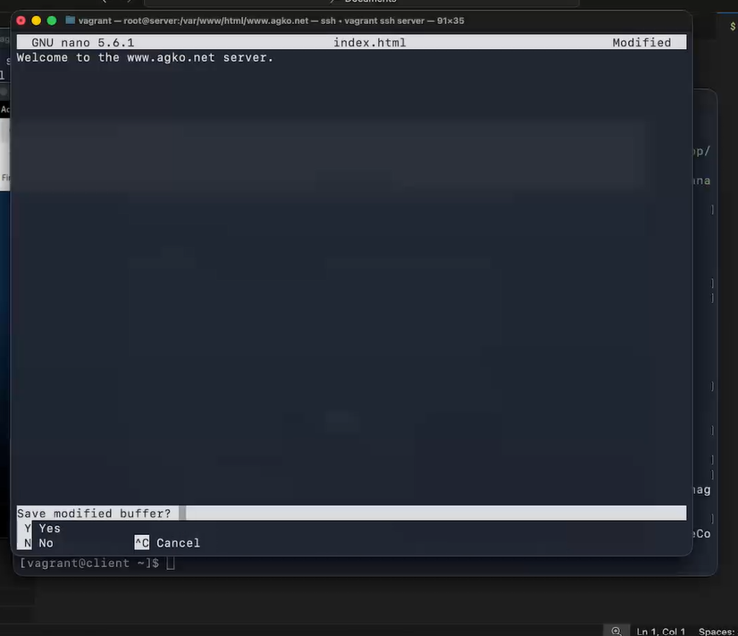
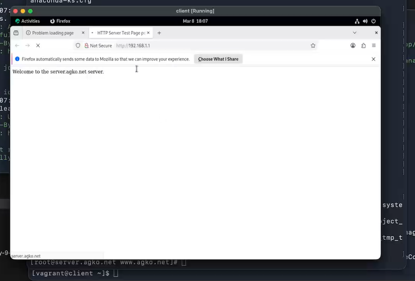
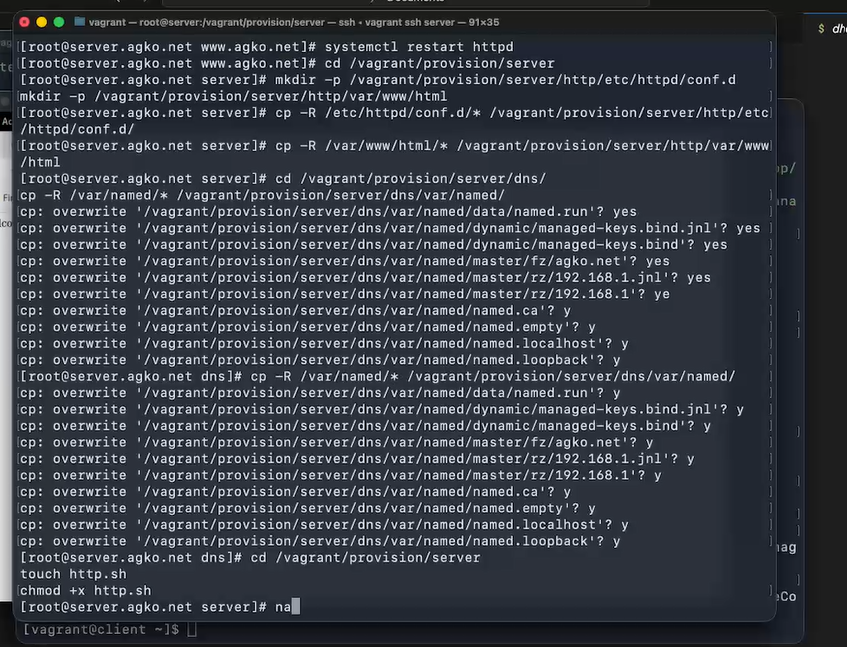
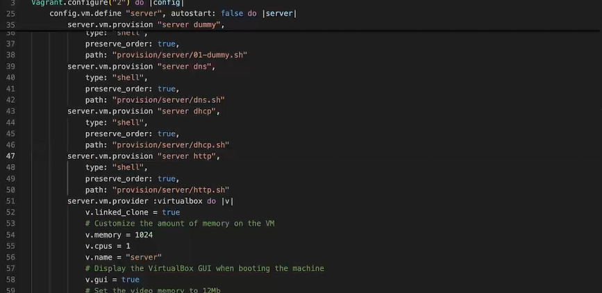

---
## Author
author:
  name: Ко Антон Геннадьевич
  degrees: DSc
  orcid: 0000-0002-0877-7063
  email: antonkosakh@gmail.com
  affiliation:
    - name: Российский университет дружбы народов
      country: Российская Федерация
      postal-code: 117198
      city: Москва
      address: ул. Миклухо-Маклая, д. 6

## Title
title: "Лабораторная работа №4"
subtitle: "Базовая настройка HTTP-сервера Apache"
license: "CC BY"
---

# Цель работы

Приобретение практических навыков по установке и базовому конфигурированию HTTP-сервера Apache.

# Задание

1. Установите необходимые для работы HTTP-сервера пакеты.
2. Запустите HTTP-сервер с базовой конфигурацией и проанализируйте его работу.
3. Настройте виртуальный хостинг.
4. Напишите скрипт для Vagrant, фиксирующий действия по установке и настройке HTTP-сервера во внутреннем окружении виртуальной машины server. Соответствующим образом внесите изменения в Vagrantfile

# Выполнение лабораторной работы

## Установка HTTP-сервера

Загрузим нашу операционную систему и перейдем в рабочий каталог с проектом:
```
cd /var/tmp/agko/vagran
```
Затем запустим виртуальную машину server:
```
make server-up
```

На виртуальной машине server войдем под созданным в предыдущей работе
пользователем и откроем терминал. Перейдем в режим суперпользователя и установим стандартный веб-сервер(рис. #fig:001):

{#fig:001 width=70%}

## Базовое конфигурирование HTTP-сервера


Просмотрим содержание конфигурационных файлов в каталогах /etc/httpd/conf и /etc/httpd/conf.d.
В каталоге /etc/httpd/conf лежат файлы httpd.conf и magic. Первый -- это основной файл конфигурации HTTP-сервера Apache. Он содержит директивы конфигурации, которые дают серверу инструкции. Второй -- данные для модуля mod_mime_magic, этот модуль определяет тип MIME файлов так же, как работает команда Unix file(1): она просматривает первые несколько байтов файла. Он задуман как «вторая линия защиты» в случаях, которые mod_mime не может разрешить. Этот модуль создан на основе бесплатной версии команды file(1) для Unix, которая использует «магические числа» и другие подсказки по содержимому файла, чтобы выяснить, что это за содержимое.
В каталоге /etc/httpd/conf.d лежат файлы autoindex.conf(настраивант листинг директорий по http, средствами веб-сервера),  fcgid.conf(настраивает клиент-серверный протокол взаимодействия веб-сервера и приложения),  manual.conf(позволяет получить доступ к руководству по адресу http://localhost/manual/),  ssl.conf(SSL-конфигурация, SSL – это протокол для безопасной передачи кодированных данных между веб-браузером и веб-сервером.), userdir.conf(конфигурация userdir  - позволяет пользователям размещать материалы на сайте, без предоставления доступа к директориям Web-сервера),  welcome.conf(включает страницу «Добро пожаловать» по умолчанию, если она есть).

Внесем изменения в настройки межсетевого экрана узла server, разрешив работу с http(рис. #fig:002):

{#fig:002 width=70%}

В первом терминале активируем и запустим HTTP-сервер следующими командами:

```
systemctl enable httpd
systemctl start httpd
```

Просмотрим расширенный лог системных сообщений, чтобы убедиться, что веб-сервер успешно запустился(рис. #fig:003):

{#fig:003 width=70%}

## Анализ работы HTTP-сервера

Запустим виртуальную машину client:
```
make client-up
```
На виртуальной машине server просмотрим лог ошибок работы веб-сервера и запустим мониторинг доступа к веб-серверу.

Затем виртуальной машине client запустим браузер и в адресной строке введите 192.168.1.1.(рис. #fig:004):

{#fig:004 width=70%}

Посмотрим информацию, отразившуюся при мониторинге(#fig:005):

{#fig:005 width=70%}

Можно увидеть ip-адрес устройства, зашедшего на веб-сервер, дату доступа, версию браузера, информацию об устройстве(его ОС и архитектура).

## Настройка виртуального хостинга для HTTP-сервера

Остановим работу DNS-сервера для внесения изменений в файлы описания DNS-зон:
```
systemctl stop named
```
Добавим запись для HTTP-сервера в конце файла прямой DNS-зоны /var/named/master/fz/agko.net:
```
server A 192.168.1.1
www A 192.168.1.1
```
и в конце файла обратной зоны /var/named/master/rz/192.168.1:
```
1 PTR server.agko.net.
1 PTR www.agko.net.
```
Также удалим из этих каталогов файлы журналов DNS: user.net.jnl и 192.168.1.jnl.

Затем перезапустим DNS-сервер командой:
```
systemctl start named
```

В каталоге /etc/httpd/conf.d создадим файлы server.agko.net.conf и www.agko.net.conf командами:
```
cd /etc/httpd/conf.d
touch server.agko.net.conf
touch www.agko.net.conf
```

Откроем на редактирование файлы server.agko.net.conf, www.agko.net и внесем следующее содержание(#fig:006):

{#fig:006 width=70%}

Перейдем в каталог /var/www/html, в котором должны находиться файлы с содержимым (контентом) веб-серверов, и создадим тестовые страницы для виртуальных веб-серверов server.agko.net и www.agko.net. Для виртуального веб-сервера server.agko.net:
```
cd /var/www/html
mkdir server.agko.net
cd /var/www/html/server.agko.net
touch index.htm
```
Откроем на редактирование файл index.html и внесем следующее содержание (рис. #fig:007):

{#fig:007 width=70%}

Для виртуального веб-сервера www.agko.net:
```
cd /var/www/html
mkdir www.agko.net
cd /var/www/html/www.agko.net
touch index.htm
```
Откроем на редактирование файл index.html и внесем следующее содержание (рис. #fig:008):

{#fig:008 width=70%}

Теперь скопируем права доступа в каталог с веб-контентом командой:
```
chown -R apache:apache /var/www
```
Затем восстановим контекст безопасности:
```
restorecon -vR /etc
restorecon -vR /var/named
restorecon -vR /var/www
```
И тперь перезапустим HTTP-сервер командой  `systemctl restart httpd`.

На виртуальной машине client убедимся в корректном доступе к веб-серверу по адресам server.agko.net и www.agko.net в адресной строке веб-браузера(рис. #fig:009):

{#fig:009 width=70%}

## Внесение изменений в настройки внутреннего окружения виртуальной машины

На виртуальной машине server перейдем в каталог для внесения изменений в настройки внутреннего окружения /vagrant/provision/server/, создадим в нём каталог http, в который поместим в соответствующие подкаталоги конфигурационные файлы HTTP-сервера, затем заменим конфигурационные файлы DNS-сервера и в каталоге /vagrant/provision/server создадим исполняемый файл http.sh(рис. #fig:010)

{#fig:010 width=70%}

Открыв http.sh на редактирование, пропишем в нём следующий скрипт(#fig:011):

{#fig:011 width=70%}

Для отработки созданного скрипта во время загрузки виртуальной машины server в конфигурационном файле Vagrantfile добавим в разделе конфигурации для сервера(#fig:012):

{#fig:012 width=70%}

# Контрольные вопросы

1. Через какой порт по умолчанию работает Apache?

По умолчанию Apache работает через порт 80.

2. Под каким пользователем запускается Apache и к какой группе относится этот пользо-
ватель?

Apache обычно запускается под пользователем "www-data" и относится к группе "www-data".

3. Где располагаются лог-файлы веб-сервера? Что можно по ним отслеживать?

Лог-файлы веб-сервера обычно располагаются в каталоге /var/log/apache2. Можно отслеживать доступ, ошибки, запросы и другую информацию.

4. Где по умолчанию содержится контент веб-серверов?

Контент веб-серверов по умолчанию содержится в каталоге /var/www/html.

5. Каким образом реализуется виртуальный хостинг? Что он даёт

Виртуальный хостинг реализуется через конфигурацию веб-сервера, позволяя одному серверу обслуживать несколько доменов. Он дает возможность размещать несколько веб-сайтов на одном сервере.

# Выводы

В результате выполнения данной работы были приобретены практические навыки по установке и базовому конфигурированию HTTP-сервера Apache.