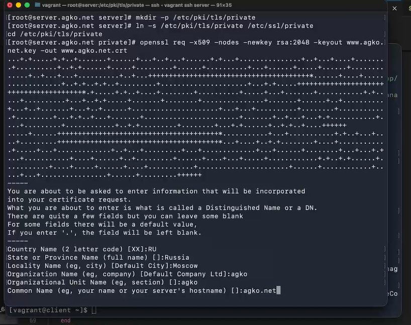
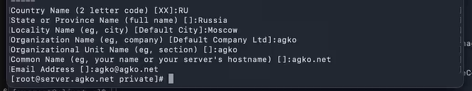
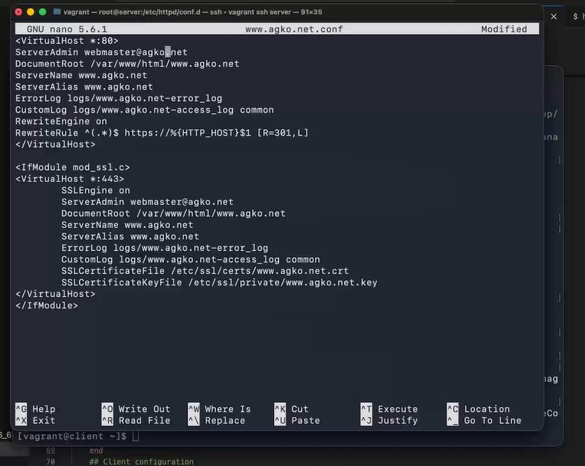
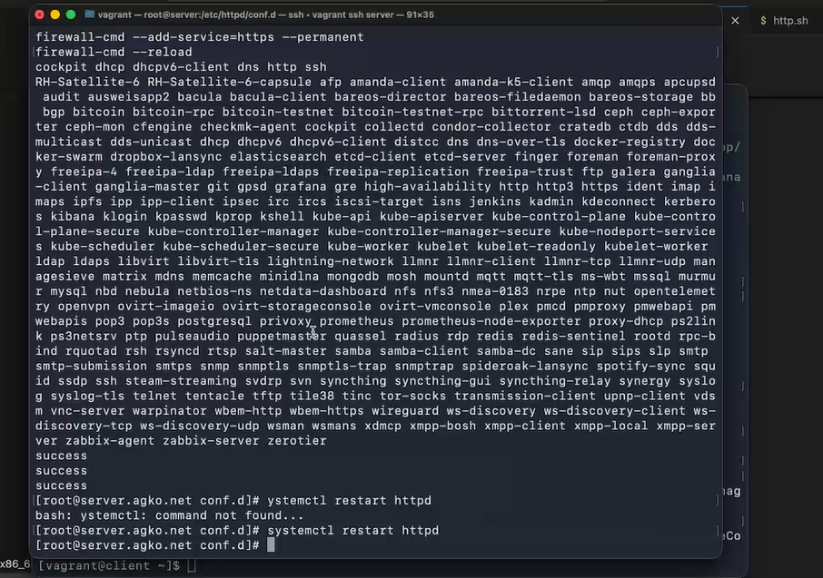
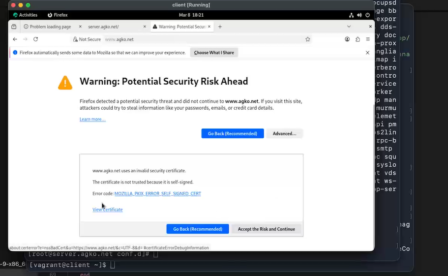
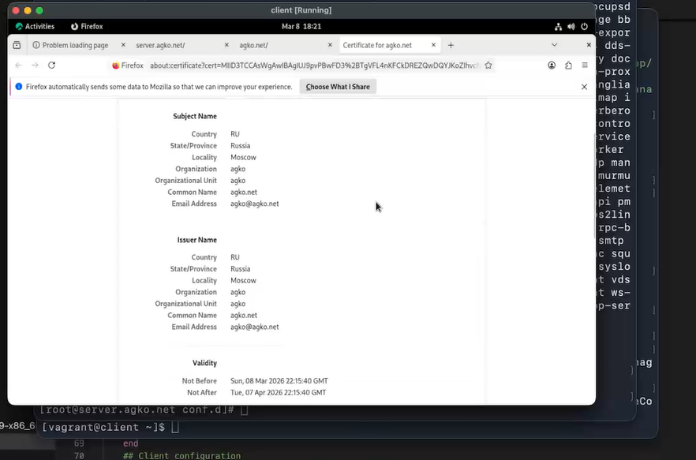
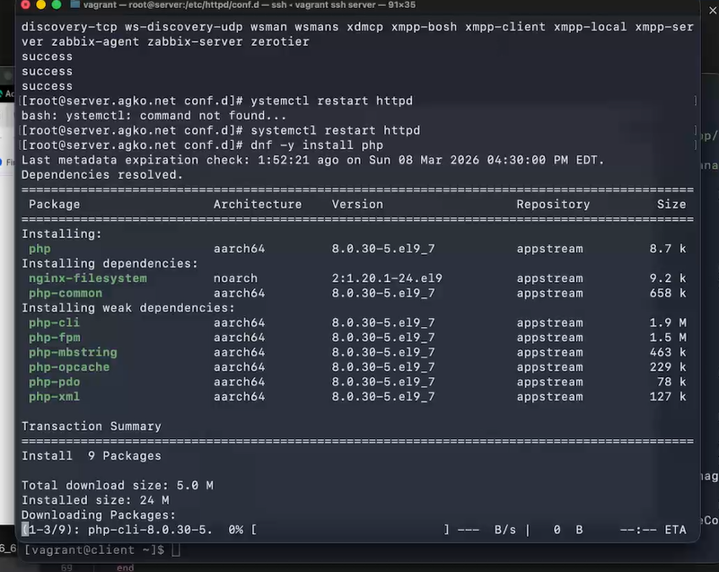
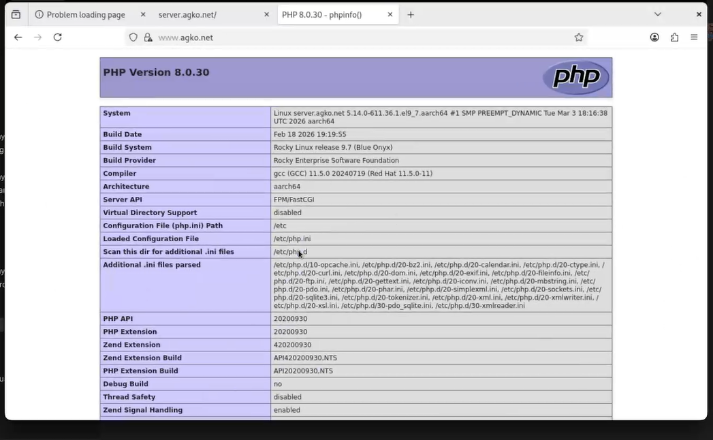
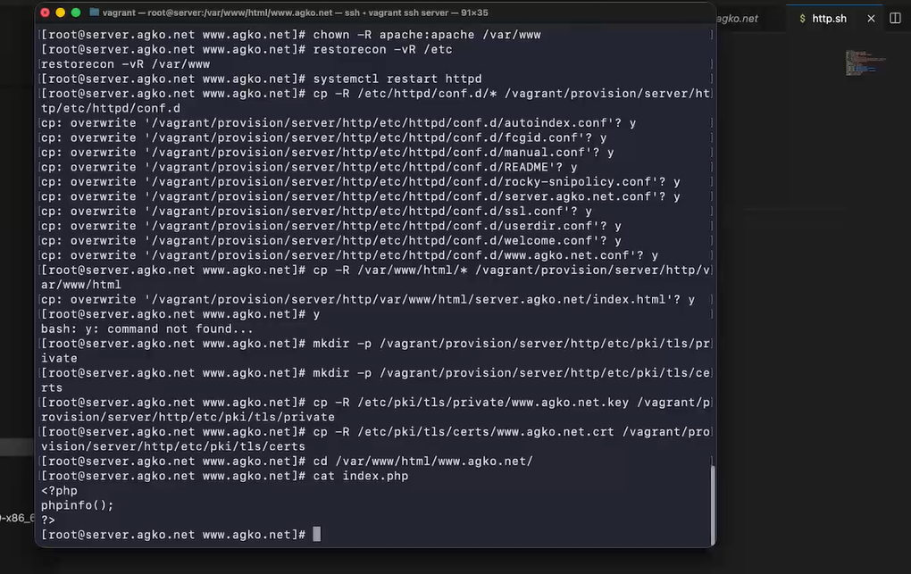
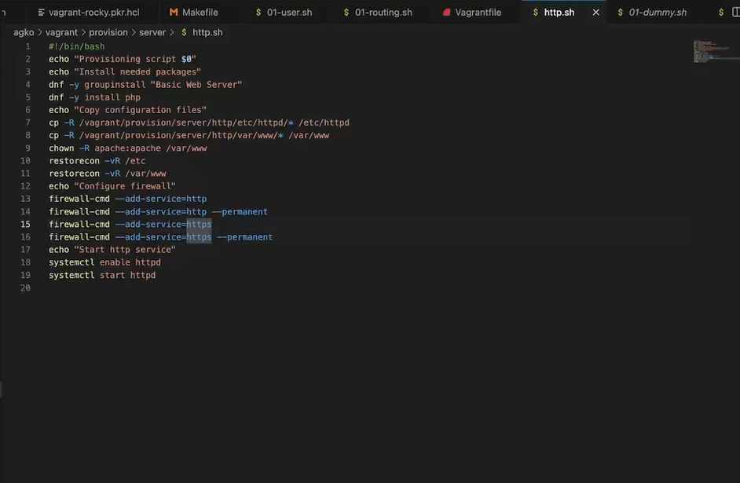

---
## Author
author:
  name: Ко Антон Геннадьевич
  degrees: DSc
  orcid: 0000-0002-0877-7063
  email: antonkosakh@gmail.com
  affiliation:
    - name: Российский университет дружбы народов
      country: Российская Федерация
      postal-code: 117198
      city: Москва
      address: ул. Миклухо-Маклая, д. 6
## Title
title: Лабораторная работа №5
subtitle: Расширенная настройка HTTP-сервера Apache
license: CC BY
date: today
date-format: "YYYY-MM-DD" # Example: 2026-03-08
---

# Информация

## Докладчик

:::::::::::::: {.columns align=center}
::: {.column width="70%"}

  * Ко Антон Геннадьевич
  * студент
  * Российский университет дружбы народов им. П. Лумумбы
  * [1132221551@rudn.ru](mailto:1132221551@rudn.ru)
  * <https://SenDerMen04.github.io/ru/>

:::
::: {.column width="30%"}


:::
::::::::::::::

# Вводная часть

## Цель работы

Приобретение практических навыков по расширенному конфигурированию HTTP-сервера Apache в части безопасности и возможности использования PHP.

## Задание

1. Сгенерируйте криптографический ключ и самоподписанный сертификат безопасности для возможности перехода веб-сервера от работы через протокол HTTP к работе через протокол HTTPS.
2. Настройте веб-сервер для работы с PHP.
3. Напишите (или скорректируйте) скрипт для Vagrant, фиксирующий действия по расширенной настройке HTTP-сервера во внутреннем окружении виртуальной машины server.

# Выполнение лабораторной работы

## Конфигурирование HTTP-сервера для работы через протокол HTTPS

{#fig:001 width=55%}

## Конфигурирование HTTP-сервера для работы через протокол HTTPS

{#fig:002 width=70%}

## Конфигурирование HTTP-сервера для работы через протокол HTTPS

{#fig:003 width=55%}

## Конфигурирование HTTP-сервера для работы через протокол HTTPS

{#fig:004 width=55%}

## Конфигурирование HTTP-сервера для работы через протокол HTTPS

{#fig:005 width=55%}

## Конфигурирование HTTP-сервера для работы через протокол HTTPS

{#fig:006 width=70%}

## Конфигурирование HTTP-сервера для работы с PHP

Установим пакеты для работы с PHP, затем в каталоге /var/www/html/www.agko.net заменим файл index.html на index.php следующего содержания:
```
<?php
phpinfo();
?>
```

## Конфигурирование HTTP-сервера для работы с PHP

{#fig:007 width=70%}

## Конфигурирование HTTP-сервера для работы с PHP

{#fig:008 width=70%}

## Внесение изменений в настройки внутреннего окружения виртуальной машины

{#fig:009 width=70%}

## Внесение изменений в настройки внутреннего окружения виртуальной машины

{#fig:010 width=70%}

# Заключение

## Выводы

В результате выполнения данной работы были приобретены практические навыки  по расширенному конфигурированию HTTP-сервера Apache в части безопасности и возможности использования PHP.