---
## Author
author:
  name: Ко Антон Геннадьевич
  degrees: DSc
  orcid: 0000-0002-0877-7063
  email: antonkosakh@gmail.com
  affiliation:
    - name: Российский университет дружбы народов
      country: Российская Федерация
      postal-code: 117198
      city: Москва
      address: ул. Миклухо-Маклая, д. 6
## Title
title: Лабораторная работа №6
subtitle: Установка и настройка системы управления базами данных MariaDB
license: CC BY
date: today
date-format: "YYYY-MM-DD" # Example: 2026-03-08
---

# Информация

## Докладчик

:::::::::::::: {.columns align=center}
::: {.column width="70%"}

  * Ко Антон Геннадьевич
  * студент
  * Российский университет дружбы народов им. П. Лумумбы
  * [1132221551@rudn.ru](mailto:1132221551@rudn.ru)
  * <https://SenDerMen04.github.io/ru/>

:::
::: {.column width="30%"}


:::
::::::::::::::

# Вводная часть

## Цель работы

Приобретение практических навыков по установке и конфигурированию системы управления базами данных на примере программного обеспечения MariaDB.

## Задание

1. Установите необходимые для работы MariaDB пакеты.
2. Настройте в качестве кодировки символов по умолчанию utf8 в базах данных.
3. В базе данных MariaDB создайте тестовую базу addressbook, содержащую таблицу city с полями name и city, т.е., например, для некоторого сотрудника указан город, в котором он работает.
4. Создайте резервную копию базы данных addressbook и восстановите из неё данные.
5. Напишите скрипт для Vagrant, фиксирующий действия по установке и настройке базы данных MariaDB во внутреннем окружении виртуальной машины server. Соответствующим образом внести изменения в Vagrantfile.

# Выполнение лабораторной работы

## Установка MariaDB

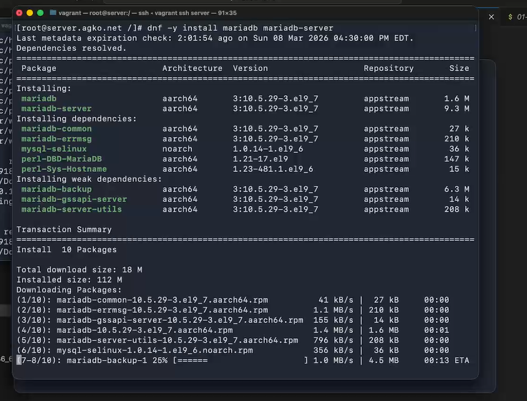{#fig:001 width=55%}

## Установка MariaDB

Для запуска и включения программного обеспечения mariadb используем:
```
systemctl start mariadb
systemctl enable mariadb
```
## Установка MariaDB

Убедимся, что mariadb прослушивает порт:

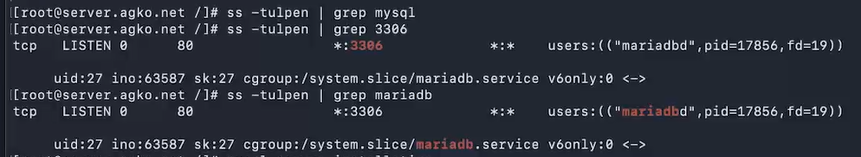{#fig:002 width=80%}

## Установка MariaDB

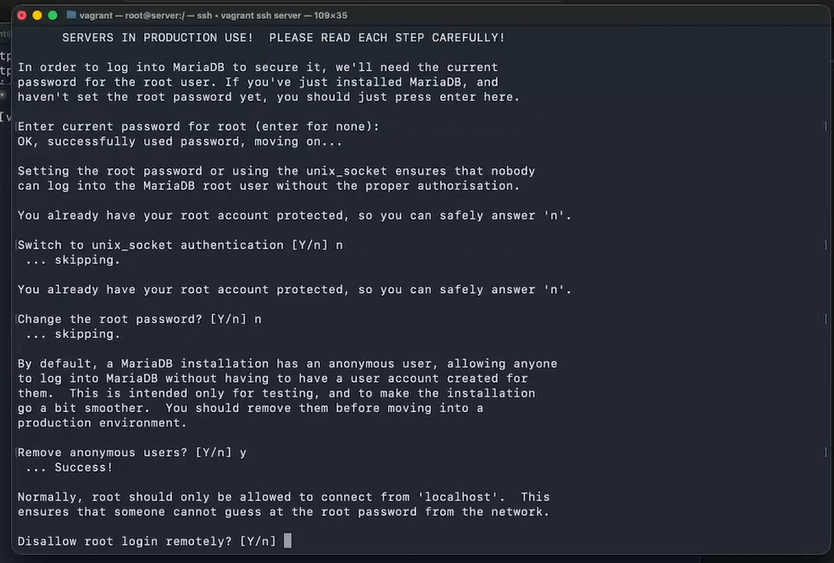{#fig:003 width=70%}

## Установка MariaDB

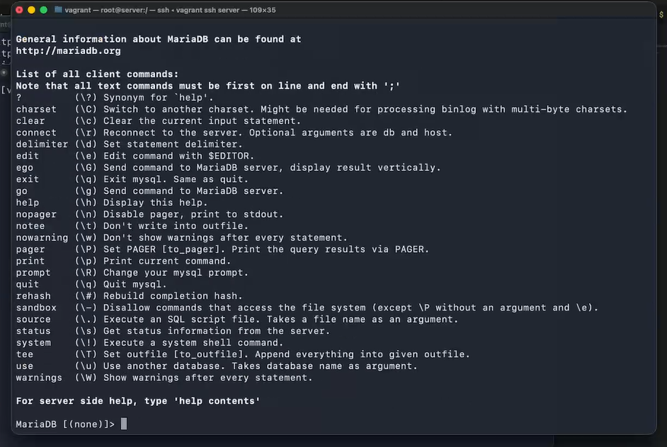{#fig:004 width=40%}

## Конфигурация кодировки символов

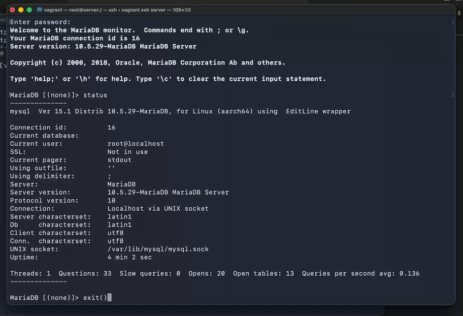{#fig:005 width=70%}

## Конфигурация кодировки символов

В каталоге /etc/my.cnf.d создадим файл utf8.cnf:
```
cd /etc/my.cnf.d
touch utf8.cnf
```
Откроем его на редактирование и укажем в нём следующую конфигурацию:
```
[client]
default-character-set = utf8
[mysqld]
character-set-server = utf8
```
Перезапустим MariaDB:
```
systemctl restart mariadb
```

## Конфигурация кодировки символов

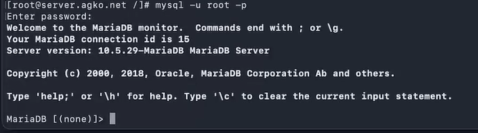{#fig:006 width=70%}

## Создание базы данных

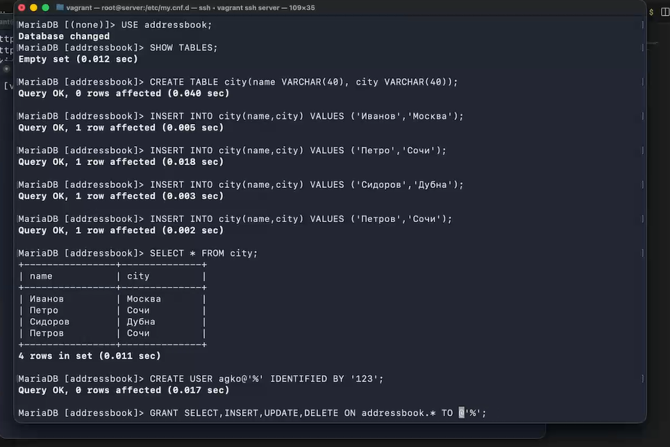{#fig:007 width=70%}

## Создание базы данных

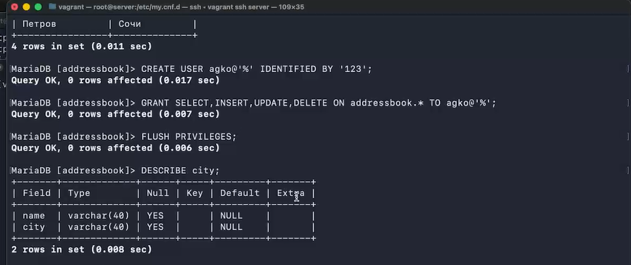{#fig:008 width=70%}

## Создание базы данных

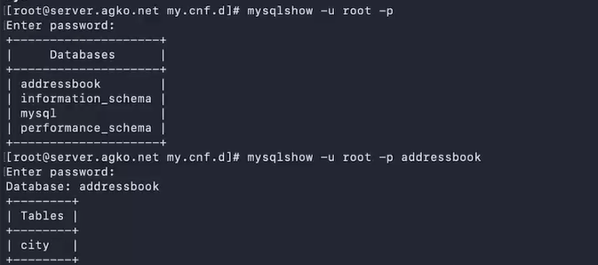{#fig:009 width=70%}

## Резервные копии

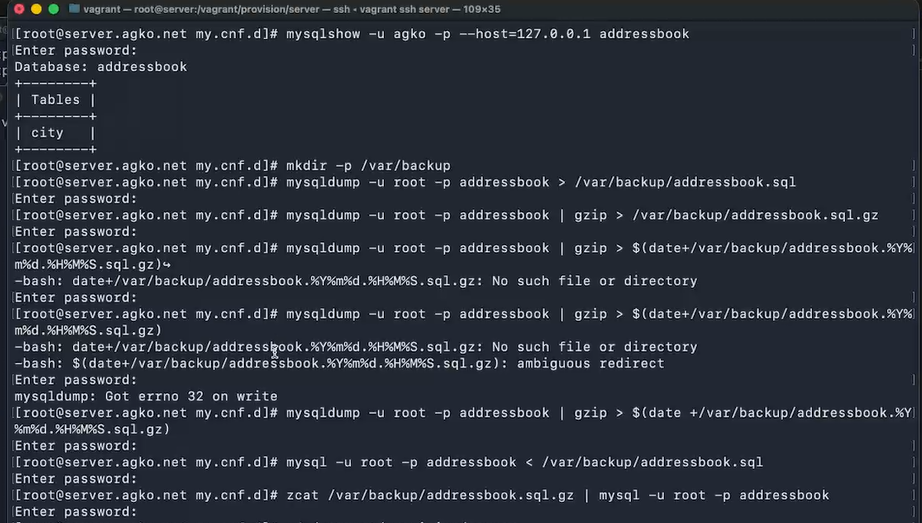{#fig:010 width=70%}

## Внесение изменений в настройки внутреннего окружения виртуальной машины

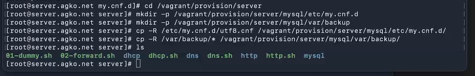{#fig:011 width=70%}

## Внесение изменений в настройки внутреннего окружения виртуальной машины

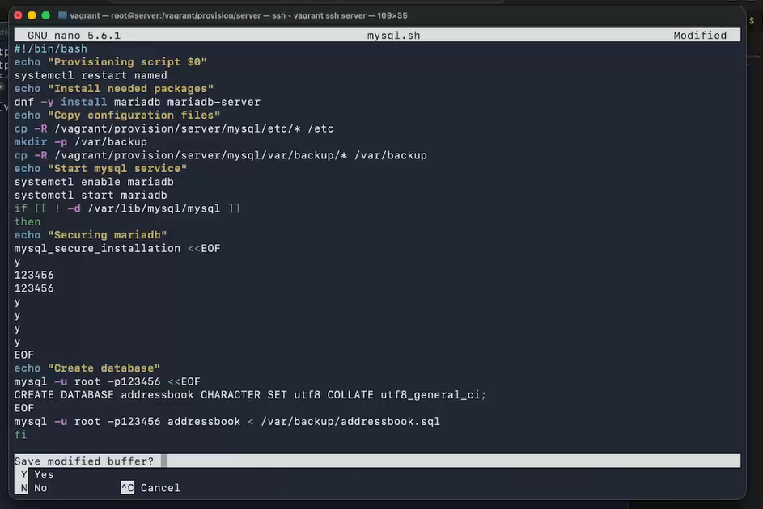{#fig:012 width=70%}

## Внесение изменений в настройки внутреннего окружения виртуальной машины

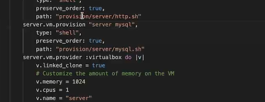{#fig:013 width=70%}

# Заключение

## Выводы

В результате выполнения данной работы были приобретены практические навыки по установке и конфигурированию системы управления базами данных на примере программного обеспечения MariaDB.