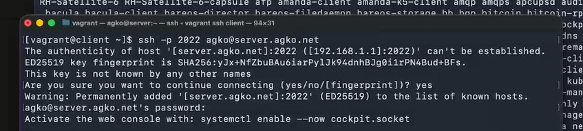
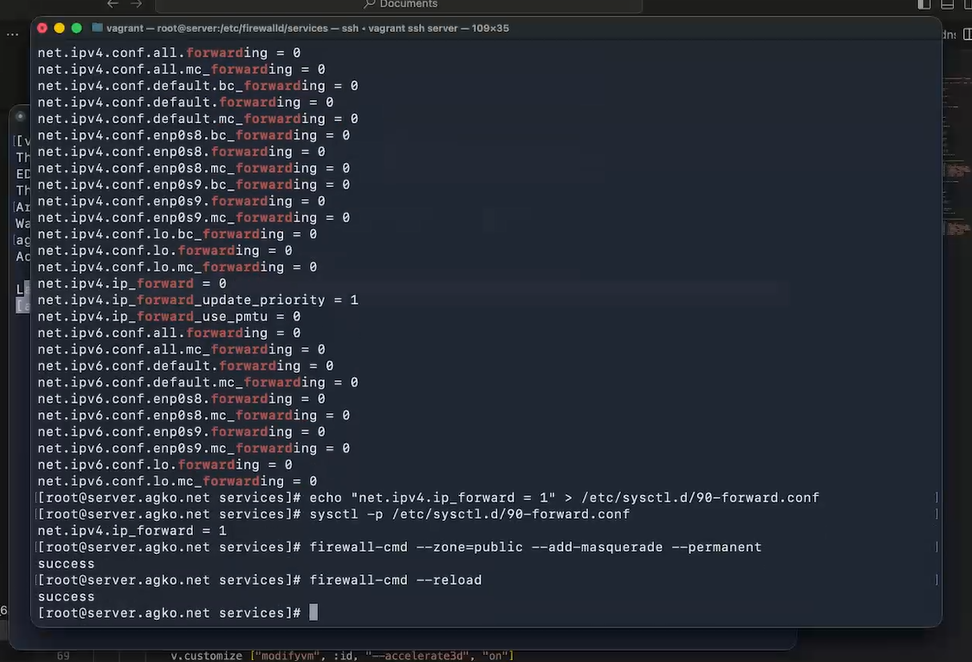
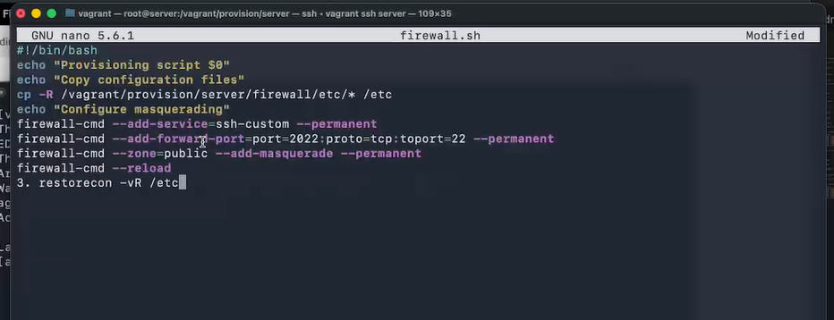

---
## Author
author:
  name: Ко Антон Геннадьевич
  degrees: DSc
  orcid: 0000-0002-0877-7063
  email: antonkosakh@gmail.com
  affiliation:
    - name: Российский университет дружбы народов
      country: Российская Федерация
      postal-code: 117198
      city: Москва
      address: ул. Миклухо-Маклая, д. 6
## Title
title: Лабораторная работа №7
subtitle: Расширенные настройки межсетевого экрана
license: CC BY
date: today
date-format: "YYYY-MM-DD" # Example: 2026-03-08
---

# Информация

## Докладчик

:::::::::::::: {.columns align=center}
::: {.column width="70%"}

  * Ко Антон Геннадьевич
  * студент
  * Российский университет дружбы народов им. П. Лумумбы
  * [1132221551@rudn.ru](mailto:1132221551@rudn.ru)
  * <https://SenDerMen04.github.io/ru/>

:::
::: {.column width="30%"}


:::
::::::::::::::

# Вводная часть

## Цель работы

Получить навыки настройки межсетевого экрана в Linux в части переадресации портов и настройки Masquerading.

## Задание

1. Настройте межсетевой экран виртуальной машины server для доступа к серверу по протоколу SSH не через 22-й порт, а через порт 2022.
2. Настройте Port Forwarding на виртуальной машине server.
3. Настройте маскарадинг на виртуальной машине server для организации доступа клиента к сети Интернет.
4. Напишите скрипт для Vagrant, фиксирующий действия по расширенной настройке межсетевого экрана. Соответствующим образом внести изменения в Vagrantfile

# Выполнение лабораторной работы

## Создание пользовательской службы firewalld

{#fig:001 width=60%}

## Создание пользовательской службы firewalld

{#fig:002 width=70%}

## Создание пользовательской службы firewalld

{#fig:003 width=70%}

## Создание пользовательской службы firewalld

{#fig:004 width=70%}

## Перенаправление портов

Организуем на сервере переадресацию с порта 2022 на порт 22 с помощью команды:
```
firewall-cmd --add-forward-port=port=2022:proto=tcp:toport=22
```
## Перенаправление портов

{#fig:005 width=70%}

## Настройка Port Forwarding и Masquerading

{#fig:006 width=50%}

## Внесение изменений в настройки внутреннего окружения виртуальной машины

{#fig:007 width=70%}

## Внесение изменений в настройки внутреннего окружения виртуальной машины

{#fig:008 width=70%}

## Внесение изменений в настройки внутреннего окружения виртуальной машины

{#fig:009 width=70%}

# Заключение

## Выводы

В результате выполнения данной работы были приобретены практические навыки настройки межсетевого экрана в Linux в части переадресации портов и настройки Masquerading.