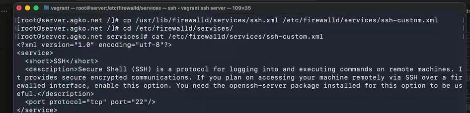
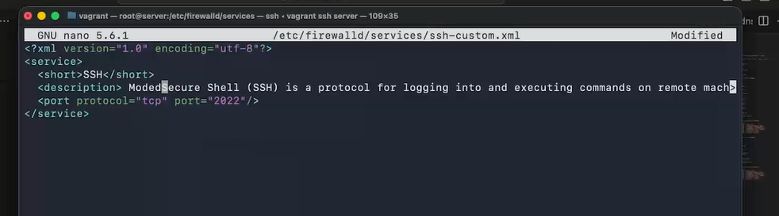
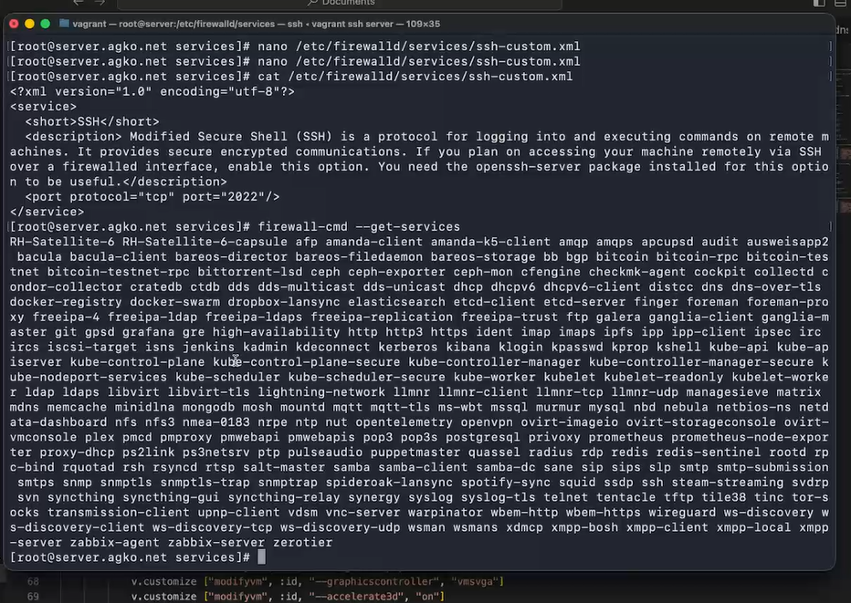
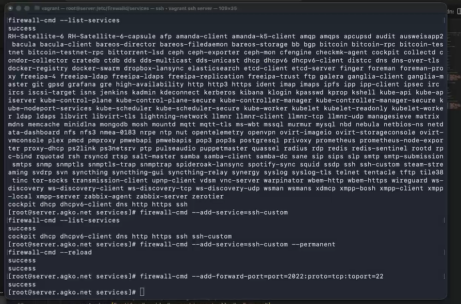
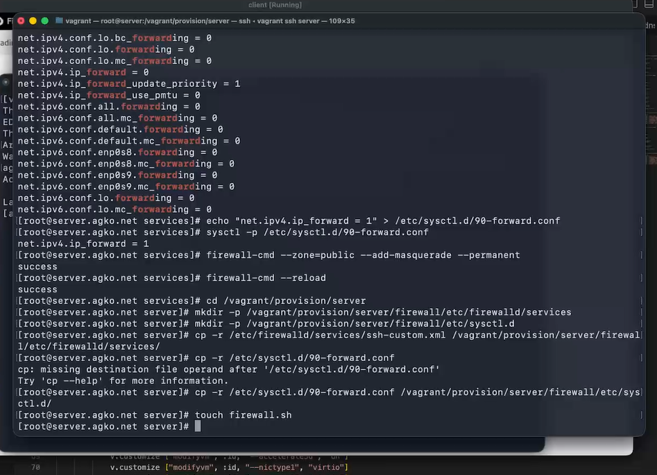
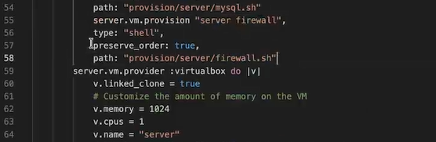

---
## Author
author:
  name: Ко Антон Геннадьевич
  degrees: DSc
  orcid: 0000-0002-0877-7063
  email: antonkosakh@gmail.com
  affiliation:
    - name: Российский университет дружбы народов
      country: Российская Федерация
      postal-code: 117198
      city: Москва
      address: ул. Миклухо-Маклая, д. 6

## Title
title: "Лабораторная работа №7"
subtitle: "Расширенные настройки межсетевого экрана"
license: "CC BY"
---

# Цель работы

Получить навыки настройки межсетевого экрана в Linux в части переадресации портов и настройки Masquerading.

# Задание

1. Настройте межсетевой экран виртуальной машины server для доступа к серверу по протоколу SSH не через 22-й порт, а через порт 2022.
2. Настройте Port Forwarding на виртуальной машине server.
3. Настройте маскарадинг на виртуальной машине server для организации доступа клиента к сети Интернет.
4. Напишите скрипт для Vagrant, фиксирующий действия по расширенной настройке межсетевого экрана. Соответствующим образом внести изменения в Vagrantfile

# Выполнение лабораторной работы

## Создание пользовательской службы firewalld

Загрузим нашу операционную систему и перейдем в рабочий каталог с проектом:
```
cd /var/tmp/agko/vagran
```
Затем запустим виртуальную машину server:
```
make server-up
```

На основе существующего файла описания службы ssh создадим файл с собственным описанием, просмотрим его содержимое(рис. #fig:001):

{#fig:001 width=70%}

В первой строчке этого файла указана версия xml и используемая кодировка - utf8. Затем указаны тег service, а внутри его тег-потомок short,внутри которого указано SSH. Также внутри указан тег description, внутри которого написано описание протокола ssh, и указан протокол передачи порта tcp и н номер порта 22.

Откроем файл описания службы на редактирование и заменим порт 22 на новый порт (2022) и скорректируем описание службы(рис. #fig:002):

{#fig:002 width=70%}

Просмотрим список доступных FirewallD служб(#fig:003):

{#fig:003 width=70%}

В этом списке нет новой службы. Теперь перезагрузим правила межметевого экрана  с сохранением информации о состоянии и вновь выведем на экран список служб, а также список активных служб. Новая служба отображается в списке доступных служб, но не активирована. Затем активируем новую службу в FirewallD и выведем на экран список активных служб(рис. #fig:004):

{#fig:004 width=70%}

## Перенаправление портов

Организуем на сервере переадресацию с порта 2022 на порт 22 с помощью команды:
```
firewall-cmd --add-forward-port=port=2022:proto=tcp:toport=22
```
На клиенте попробуем получить доступ по SSH к серверу через порт 2022(рис. #fig:005):

{#fig:005 width=70%}

## Настройка Port Forwarding и Masquerading

На сервере посмотрим, активирована ли в ядре системы возможность перенаправления IPv4-пакетов, затем включим пренаправление IPv4-пакетов на сервере и включим маскарадинг на сервере(#fig:006):

{#fig:006 width=70%}

Теперь проверим доступность выхода в Интернет на клиенте.

## Внесение изменений в настройки внутреннего окружения виртуальной машины

На виртуальной машине server перейдем в каталог для внесения изменений в настройки внутреннего окружения /vagrant/provision/server/, создадим в нём каталог firewall, в который поместим в соответствующие подкаталоги конфигурационные файлы FirewallD и создадим исполняемый файл firewall.sh(рис. #fig:007)

{#fig:007 width=70%}

Открыв firewall.sh на редактирование, пропишем в нём следующий скрипт(#fig:008):

{#fig:008 width=70%}

Для отработки созданного скрипта во время загрузки виртуальной машины server в конфигурационном файле Vagrantfile добавим в разделе конфигурации для сервера(#fig:009):

{#fig:009 width=70%}

# Контрольные вопросы

1. Где хранятся пользовательские файлы firewalld?

```
/usr/lib/firewalld/services/s
```

2. Какую строку надо включить в пользовательский файл службы, чтобы указать порт
TCP 2022?

```
<port protocol="tcp" port="2022"/>
```

3. Какая команда позволяет вам перечислить все службы, доступные в настоящее время
на вашем сервере?

```
firewall-cmd --get-services
```

4. В чем разница между трансляцией сетевых адресов (NAT) и маскарадингом (masquera-
ding)?

При маскарадинге вместо адреса отправителя(как делается это в NAT) динамически подставляется адрес назначенного интерфейса (сетевой адрес + порт).

5. Какая команда разрешает входящий трафик на порт 4404 и перенаправляет его в службу ssh по IP-адресу 10.0.0.10?

```
sudo firewall-cmd --add-forward-port=port=4404:proto=tcp:toport=22:toaddr=10.0.0.10
```

6. Какая команда используется для включения маcкарадинга IP-пакетов для всех пакетов, выходящих в зону public?

```
firewall-cmd --zone=public --add-masquerade --permanent
```

# Выводы

В результате выполнения данной работы были приобретены практические навыки настройки межсетевого экрана в Linux в части переадресации портов и настройки Masquerading.