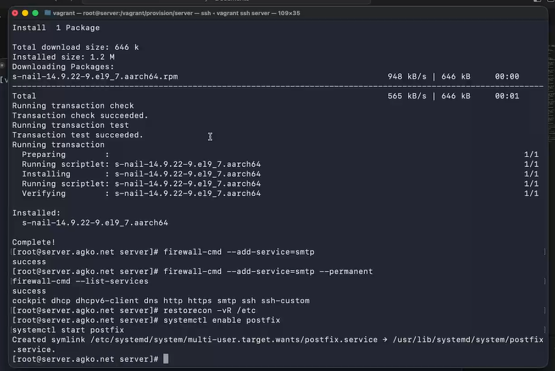
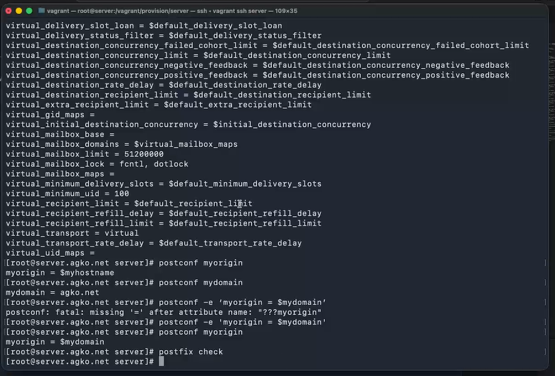
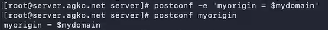
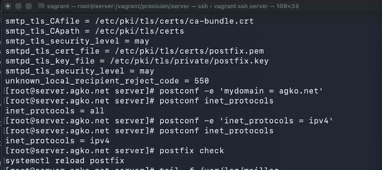
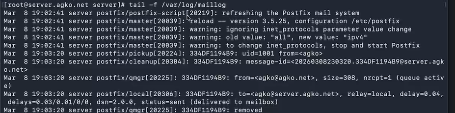
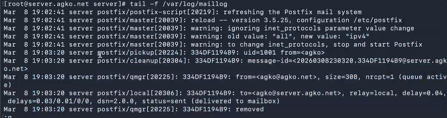
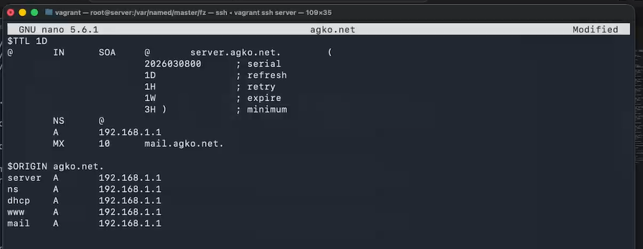
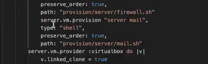
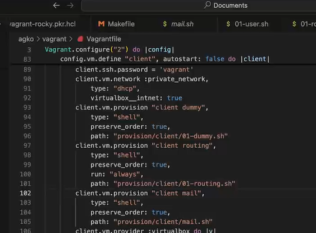

---
## Author
author:
  name: Ко Антон Геннадьевич
  degrees: DSc
  orcid: 0000-0002-0877-7063
  email: antonkosakh@gmail.com
  affiliation:
    - name: Российский университет дружбы народов
      country: Российская Федерация
      postal-code: 117198
      city: Москва
      address: ул. Миклухо-Маклая, д. 6
## Title
title: Лабораторная работа №8
subtitle: Настройка SMTP-сервера
license: CC BY
date: today
date-format: "YYYY-MM-DD" # Example: 2026-03-08
---

# Информация

## Докладчик

:::::::::::::: {.columns align=center}
::: {.column width="70%"}

  * Ко Антон Геннадьевич
  * студент
  * Российский университет дружбы народов им. П. Лумумбы
  * [1132221551@rudn.ru](mailto:1132221551@rudn.ru)
  * <https://SenDerMen04.github.io/ru/>

:::
::: {.column width="30%"}


:::
::::::::::::::

# Вводная часть

## Цель работы

Приобретение практических навыков по установке и конфигурированию SMTP-сервера.

## Задание

1. Установите на виртуальной машине server SMTP-сервер postfix.
2. Сделайте первоначальную настройку postfix при помощи утилиты postconf, задав отправку писем не на локальный хост, а на сервер в домене.
3. Проверьте отправку почты с сервера и клиента.
4. Сконфигурируйте Postfix для работы в домене. Проверьте отправку почты с сервера и клиента.
5. Напишите скрипт для Vagrant, фиксирующий действия по установке и настройке Postfix во внутреннем окружении виртуальной машины server. Соответствующим образом внесите изменения в Vagrantfile.

# Выполнение лабораторной работы

## Установка Postfix

{#fig:001 width=70%}

## Изменение параметров Postfix с помощью postconf

{#fig:002 width=50%}

## Изменение параметров Postfix с помощью postconf

Заменим значение параметра myorigin на значение параметра mydomain и снова посмотрим значение myorigin:

{#fig:003 width=70%}

## Изменение параметров Postfix с помощью postconf

{#fig:004 width=60%}

## Проверка работы Postfix

На сервере под учётной записью пользователя отправим себе письмо, используя утилиту mail с помощью команды:

```
echo .| mail -s test1 agko@server.agko.net
```

## Проверка работы Postfix

{#fig:005 width=70%}

## Проверка работы Postfix

{#fig:006 width=60%}

## Конфигурация Postfix для домена

{#fig:007 width=70%}

## Конфигурация Postfix для домена

{#fig:008 width=70%}

## Конфигурация Postfix для домена

{#fig:009 width=70%}

## Конфигурация Postfix для домена

{#fig:010 width=70%}

## Конфигурация Postfix для домена

В конфигурации Postfix добавим домен в список элементов сети, для которых данный сервер является конечной точкой доставки почты с помощью команды:

```
postconf -e 'mydestination = $myhostname, localhost.$mydomain, 
localhost, $mydomain
```

## Конфигурация Postfix для домена

А затем перезагрузим конфигурацию Postfix, восстановим контекст безопасности  в SELinux и перезапустим DNS:

```
postfix check
systemctl reload postfix

restorecon -vR /etc
restorecon -vR /var/named

systemctl restart named
```

## Конфигурация Postfix для домена

{#fig:011 width=70%}

## Конфигурация Postfix для домена и Внесение изменений в настройки внутреннего окружения виртуальной машины

{#fig:012 width=70%}

## Внесение изменений в настройки внутреннего окружения виртуальной машины

{#fig:013 width=70%}

## Внесение изменений в настройки внутреннего окружения виртуальной машины

{#fig:014 width=70%}

## Внесение изменений в настройки внутреннего окружения виртуальной машины

{#fig:015 width=70%}

## Внесение изменений в настройки внутреннего окружения виртуальной машины

{#fig:016 width=70%}

## Внесение изменений в настройки внутреннего окружения виртуальной машины

{#fig:017 width=70%}

# Заключение

## Выводы

В результате выполнения данной работы были приобретены практические навыки по установке и конфигурированию SMTP-сервера.