---
## Author
author:
  name: Ко Антон Геннадьевич
  degrees: DSc
  orcid: 0000-0002-0877-7063
  email: antonkosakh@gmail.com
  affiliation:
    - name: Российский университет дружбы народов
      country: Российская Федерация
      postal-code: 117198
      city: Москва
      address: ул. Миклухо-Маклая, д. 6
## Title
title: Лабораторная работа №9
subtitle: Настройка POP3/IMAP сервера
license: CC BY
date: today
date-format: "YYYY-MM-DD" # Example: 2026-03-08
---

# Информация

## Докладчик

:::::::::::::: {.columns align=center}
::: {.column width="70%"}

  * Ко Антон Геннадьевич
  * студент
  * Российский университет дружбы народов им. П. Лумумбы
  * [1132221551@rudn.ru](mailto:1132221551@rudn.ru)
  * <https://SenDerMen04.github.io/ru/>

:::
::: {.column width="30%"}


:::
::::::::::::::

# Вводная часть

## Цель работы

Приобретение практических навыков по установке и простейшему конфигурированию POP3/IMAP-сервера.

## Задание

1. Установите на виртуальной машине server Dovecot и Telnet для дальнейшей проверки корректности работы почтового сервера.
2. Настройте Dovecot.
3. Установите на виртуальной машине client программу для чтения почты Evolution и настройте её для манипуляций с почтой вашего пользователя. Проверьте корректность работы почтового сервера как с виртуальной машины server, так и с виртуальной машины client.
4. Измените скрипт для Vagrant, фиксирующий действия по установке и настройке Postfix и Dovecote во внутреннем окружении виртуальной машины server, создайте скрипт для Vagrant, фиксирующий действия по установке Evolution во внутреннем окружении виртуальной машины client. Соответствующим образом внесите изменения в Vagrantfile.

# Выполнение лабораторной работы

## Установка Dovecot

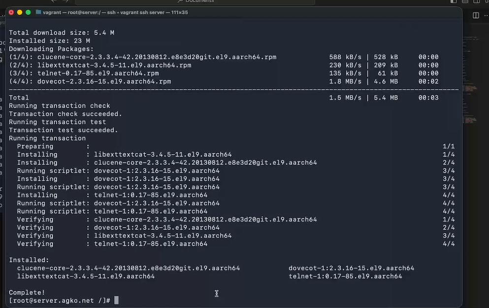{#fig:001 width=70%}

## Настройка dovecot

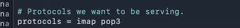{#fig:002 width=70%}

## Настройка dovecot

{#fig:003 width=70%}

## Настройка dovecot

{#fig:004 width=70%}

## Настройка dovecot

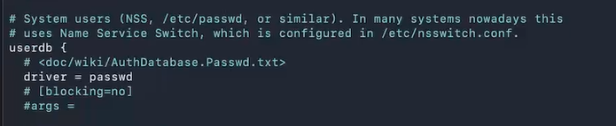{#fig:005 width=70%}

## Настройка dovecot

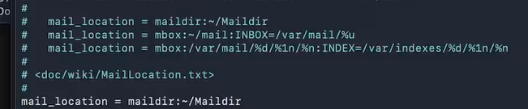{#fig:006 width=70%}

## Настройка dovecot

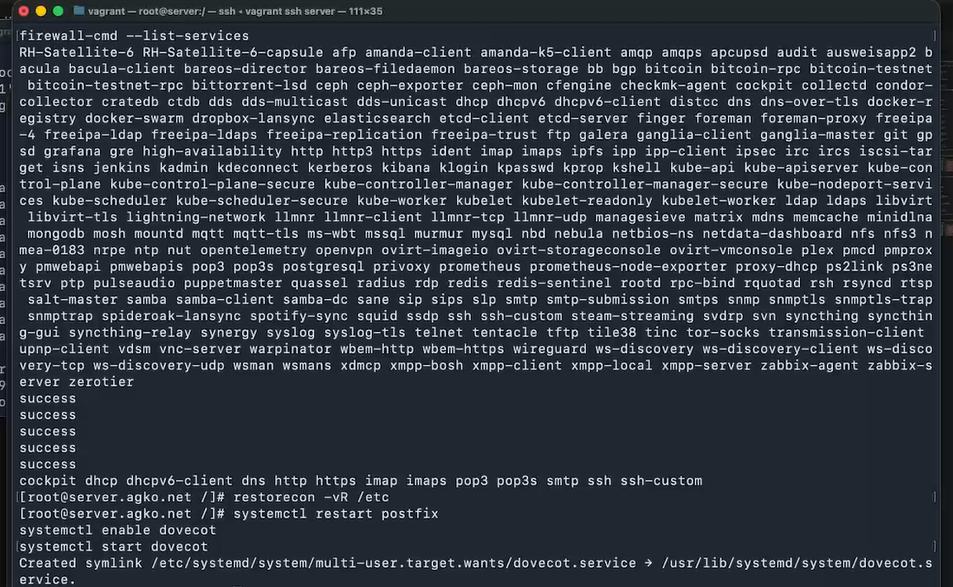{#fig:007 width=60%}


## Проверка работы Dovecot

На дополнительном терминале виртуальной машины server запустим мониторинг
работы почтовой службы с помощью команды:

```
tail -f /var/log/maillog
```

## Проверка работы Dovecot

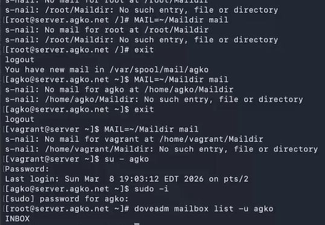{#fig:008 width=70%}

## Проверка работы Dovecot

{#fig:009 width=70%}

## Проверка работы Dovecot

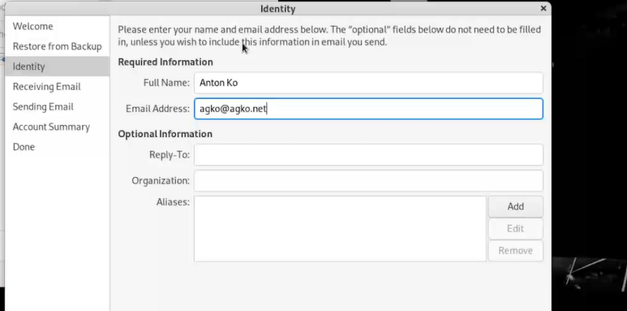{#fig:010 width=60%}

## Проверка работы Dovecot

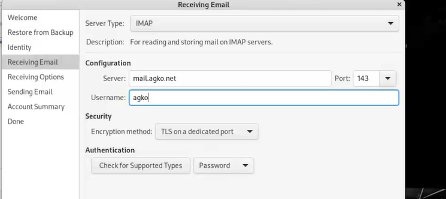{#fig:011 width=60%}

## Проверка работы Dovecot

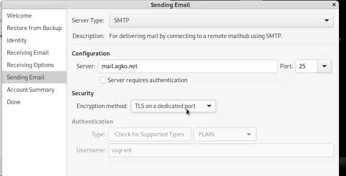{#fig:012 width=60%}

## Проверка работы Dovecot

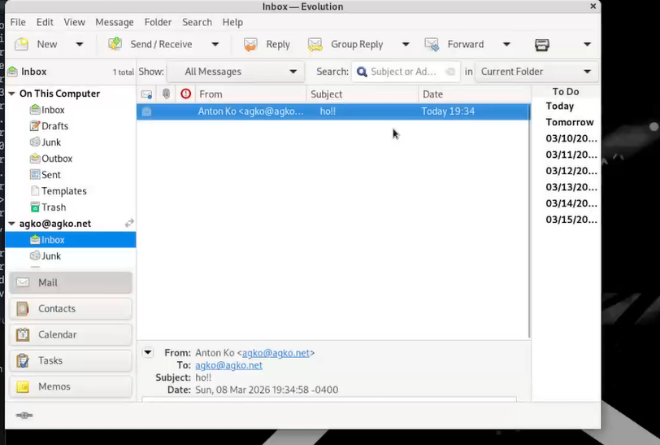{#fig:013 width=60%}

## Проверка работы Dovecot

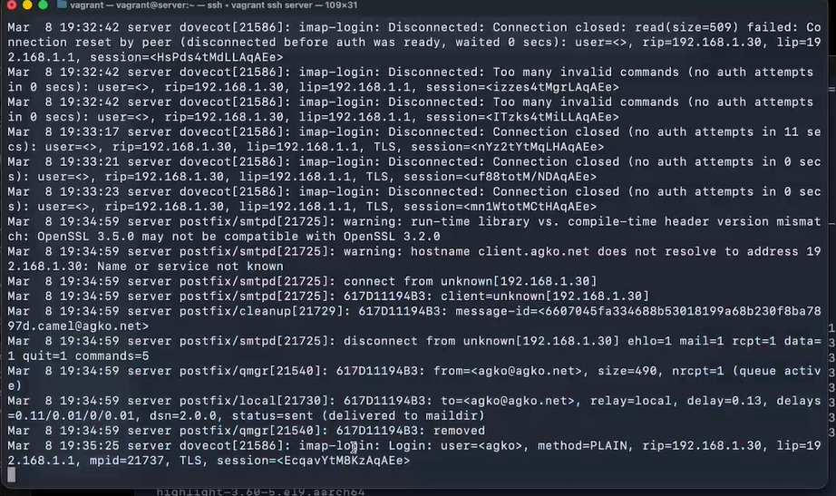{#fig:014 width=70%}

## Проверка работы Dovecot

{#fig:015 width=70%}

## Проверка работы Dovecot

{#fig:016 width=55%}

## Внесение изменений в настройки внутреннего окружения виртуальной машины

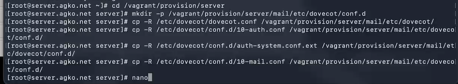{#fig:017 width=70%}

## Внесение изменений в настройки внутреннего окружения виртуальной машины

{#fig:018 width=50%}

## Внесение изменений в настройки внутреннего окружения виртуальной машины

{#fig:019 width=70%}

# Заключение

## Выводы

В результате выполнения данной работы были приобретены практические навыки по установке и простейшему конфигурированию POP3/IMAP-сервера.