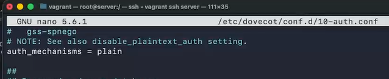
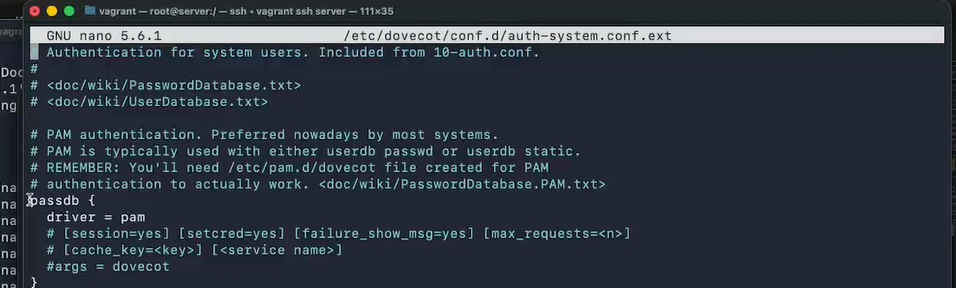
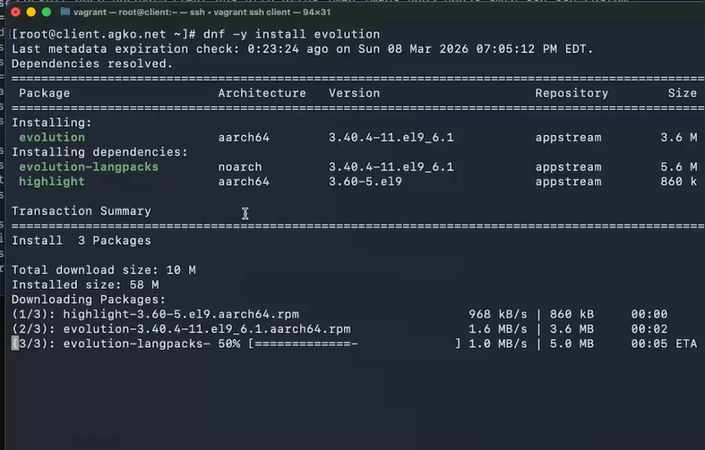
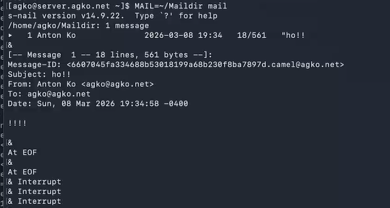
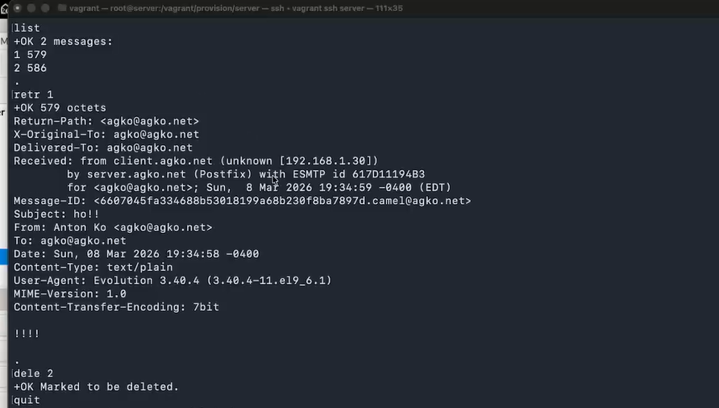
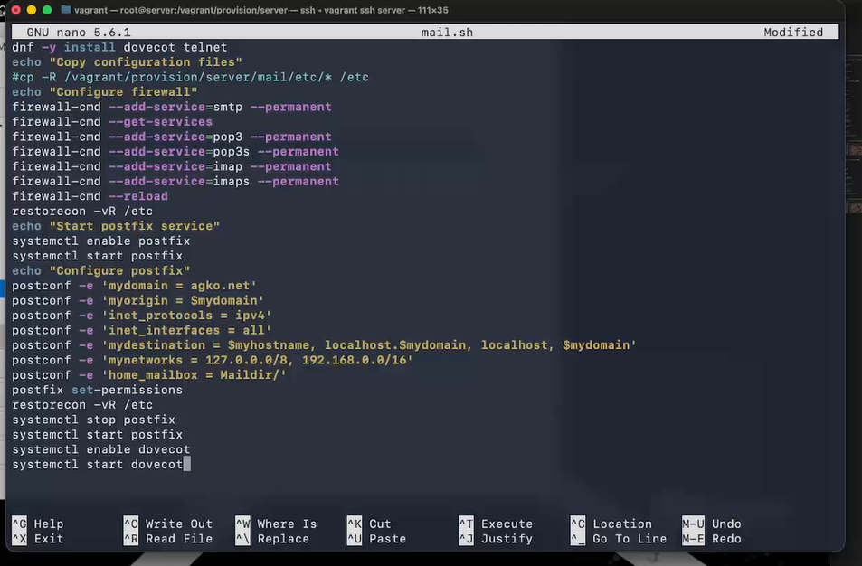
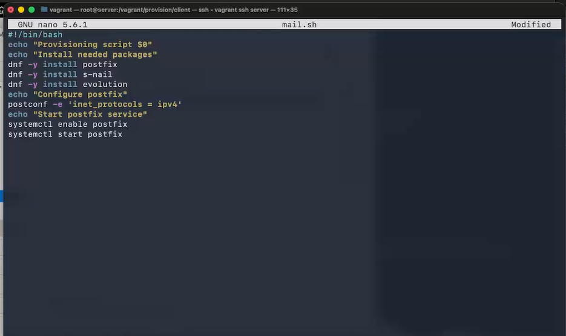

---
## Author
author:
  name: Ко Антон Геннадьевич
  degrees: DSc
  orcid: 0000-0002-0877-7063
  email: antonkosakh@gmail.com
  affiliation:
    - name: Российский университет дружбы народов
      country: Российская Федерация
      postal-code: 117198
      city: Москва
      address: ул. Миклухо-Маклая, д. 6

## Title
title: "Лабораторная работа №9"
subtitle: "Настройка POP3/IMAP сервера"
license: "CC BY"
---

# Цель работы

Приобретение практических навыков по установке и простейшему конфигурированию POP3/IMAP-сервера.

# Задание

1. Установите на виртуальной машине server Dovecot и Telnet для дальнейшей проверки корректности работы почтового сервера.
2. Настройте Dovecot.
3. Установите на виртуальной машине client программу для чтения почты Evolution и настройте её для манипуляций с почтой вашего пользователя. Проверьте корректность работы почтового сервера как с виртуальной машины server, так и с виртуальной машины client.
4. Измените скрипт для Vagrant, фиксирующий действия по установке и настройке Postfix и Dovecote во внутреннем окружении виртуальной машины server, создайте скрипт для Vagrant, фиксирующий действия по установке Evolution во внутреннем окружении виртуальной машины client. Соответствующим образом внесите изменения в Vagrantfile.

# Выполнение лабораторной работы

## Установка Dovecot

Загрузим нашу операционную систему и перейдем в рабочий каталог с проектом:
```
cd /var/tmp/agko/vagran
```
Затем запустим виртуальную машину server:
```
make server-up
```

Откроем терминал и, перейдя в режим суперпользователя, установим необходимые для работы пакеты(рис. #fig:001):

{#fig:001 width=70%}

На основе существующего файла описания службы ssh создадим файл с собственным описанием, просмотрим его содержимое

## Настройка dovecot

В конфигурационном файле /etc/dovecot/dovecot.conf пропишем список почтовых протоколов, по которым разрешено работать Dovecot(рис. #fig:002):

{#fig:002 width=70%}

В конфигурационном файле /etc/dovecot/conf.d/10-auth.conf укажем метод аутентификации plain(#fig:003):

{#fig:003 width=70%}

В конфигурационном файле /etc/dovecot/conf.d/auth-system.conf.ext проверим, что для поиска пользователей и их паролей используется pam и файл passwd(рис. #fig:004, #fig:005):

{#fig:004 width=70%}

{#fig:005 width=70%}

В конфигурационном файле /etc/dovecot/conf.d/10-mail.conf настроим месторасположение почтовых ящиков пользователей(рис. #fig:006):

{#fig:006 width=70%}

В Postfix зададим каталог для доставки почты, затем сконфигурируем межсетевой экран, разрешив работать службам  протоколов POP3 и IMAP, восстановим контекст безопасности SELinux, а затем перезапустим Postfix и запустим Dovecot(#fig:007):

{#fig:007 width=70%}


## Проверка работы Dovecot

На дополнительном терминале виртуальной машины server запустим мониторинг
работы почтовой службы с помощью команды:

```
tail -f /var/log/maillog
```

На терминале сервера просмотрим имеющуюся почту и mailbox пользователя на сервере(#fig:008):

{#fig:008 width=70%}

На виртуальной машине client войдем под своим пользователем и откроем терминал. Перейдем в режим суперпользователя и установим почтовый клиент(#fig:009):

{#fig:009 width=70%}

Запустим и настроим почтовый клиент Evolution. 

В окне настройки учётной записи почты укажим имя, адрес почты agko@agko.net (вместо user укажите свой логин), введите пароль нашего пользователя(рис. #fig:010):

{#fig:010 width=70%}

В качестве IMAP-сервера для входящих сообщений и SMTP-сервера для исходящих
сообщений пропишем mail.agko.net, в качестве пользователя для входящих
и исходящих сообщений укажем agko, также укажем номера портов: для IMAP -- порт 143, для SMTP -- порт 25, и укажем настройки SSL и метода аутентификации: для IMAP -- STARTTLS, аутентификация по обычному паролю, для SMTP -- без аутентификации, аутентификация -- «Без аутентификации»(рис. #fig:011, #fig:012):

{#fig:011 width=70%}

{#fig:012 width=70%}

Из почтового клиента отправим себе два тестовых письма, убедимся, что они
доставлены(рис. #fig:013):

{#fig:013 width=70%}

Посмотрим, какие сообщения выдаются при мониторинге почтовой службы на сервере, а также при использовании doveadm и mail(рис. #fig:014, #fig:015):

{#fig:014 width=70%}

{#fig:015 width=70%}

При мониторинге почтовой службы на сервере можно увидеть, что происходит подключение неизвестному домену, затем указывается информация о пользователе с почтового клиенте и происходит получение письма адресом agko@agko.net от себя самого, и таким образом получено два письма. При использовании mail теперь показываются два полученных письма с указанием имени отправителя, даты и времени, длины и темы письма. При использовании doveadm всё также показана директория mailbox.

Проверим работу почтовой службы, используя на сервере протокол Telnet. Для этого подключимся с помощью протокола Telnet к почтовому серверу по протоколу POP3
(через порт 110), введем свой логин для подключения и пароль. А затем с помощью команды list получим список писем; с помощью команды retr 1 получим первое письмо из списка; с помощью команды dele 2 удалим второе письмо из списка; с помощью команды quit завершите сеанс работы с telnet(рис. #fig:016):

{#fig:016 width=70%}

## Внесение изменений в настройки внутреннего окружения виртуальной машины

На виртуальной машине server перейдем в каталог для внесения изменений в настройки внутреннего окружения /vagrant/provision/server/. В соответствующие подкаталоги поместим конфигурационные файлы Doveco, а также заменим конфигурационный файл Postfix(рис. #fig:017)

{#fig:017 width=70%}

Внесием изменения в файл /vagrant/provision/server/mail.sh, добавив в него
строки по установке Dovecot и Telnet; по настройке межсетевого экрана; по настройке Postfix в части задания месторасположения почтового ящика; по перезапуску Postfix и запуску Dovecot(#fig:018):

{#fig:018 width=70%}

На виртуальной машине client в каталоге /vagrant/provision/client скорректируем файл mail.sh, прописав в нём команду для установки почтового клиента evolution(#fig:019):

{#fig:019 width=70%}

# Контрольные вопросы

1. За что отвечает протокол SMTP?

У протокола две главные задачи:

- Проверка корректности настроек системы и предоставление «разрешения» на отправку email-сообщения для определенного устройства.
- Отправка исходящего сообщения на заданный адрес электронной почты и подтверждение успешной доставки. Если сообщение доставить не удается, отправитель получает соответствующее извещение.
  
2. За что отвечает протокол IMAP?

Протокол IMAP (Internet Message Access Protocol) отвечает за доступ к почтовому ящику, позволяя пользователям получать и управлять электронными сообщениями на сервере

3. За что отвечает протокол POP3?

Протокол POP3 (Post Office Protocol version 3) отвечает за получение электронной почты с почтового сервера на устройство пользователя.

4. В чём назначение Dovecot?

Dovecot — агент доставки почты (MDA) по протоколам POP3 и IMAP с возможностью обеспечения безопасности и надёжности за счёт использования протокола TLS. 

5. В каких файлах обычно находятся настройки работы Dovecot? За что отвечает каждый из файлов?

Конфигурация Dovecot располагается в файле /etc/dovecot/dovecot.conf и в файлах каталога /etc/dovecot/conf.d. Файл сертификатов безопасности Dovecot располагается в каталоге /etc/pki/dovecot.

6. В чём назначение Postfix?

Postfix - это почтовый агент (MTA), используемый для маршрутизации и доставки электронной почты.

7. Какие методы аутентификации пользователей можно использовать в Dovecot и в чём их отличие?

В Dovecot можно использовать методы аутентификации, такие как Plain, CRAM-MD5, Digest-MD5, NTLM и другие. Они отличаются способом передачи учётных данных и уровнем безопасности. Plain передаёт данные в открытом виде, в то время как CRAM-MD5 и Digest-MD5 используют хэширование для безопасной передачи паролей. NTLM - это протокол Windows для аутентификации.

# Выводы

В результате выполнения данной работы были приобретены практические навыки по установке и простейшему конфигурированию POP3/IMAP-сервера.