---
## Author
author:
  name: Ко Антон Геннадьевич
  degrees: DSc
  orcid: 0000-0002-0877-7063
  email: antonkosakh@gmail.com
  affiliation:
    - name: Российский университет дружбы народов
      country: Российская Федерация
      postal-code: 117198
      city: Москва
      address: ул. Миклухо-Маклая, д. 6
## Title
title: Лабораторная работа №10
subtitle: Расширенные настройки SMTP-сервера
license: CC BY
date: today
date-format: "YYYY-MM-DD" # Example: 2026-03-08
---

# Информация

## Докладчик

:::::::::::::: {.columns align=center}
::: {.column width="70%"}

  * Ко Антон Геннадьевич
  * студент
  * Российский университет дружбы народов им. П. Лумумбы
  * [1132221551@rudn.ru](mailto:1132221551@rudn.ru)
  * <https://SenDerMen04.github.io/ru/>

:::
::: {.column width="30%"}


:::
::::::::::::::

# Вводная часть

## Цель работы

Приобретение практических навыков по конфигурированию SMTP-сервера в части настройки аутентификации.

## Задание

1. Настройте Dovecot для работы с LMTP.
2. Настройте аутентификацию посредством SASL на SMTP-сервере.
3. Настройте работу SMTP-сервера поверх TLS.
4. Скорректируйте скрипт для Vagrant, фиксирующий действия расширенной настройки SMTP-сервера во внутреннем окружении виртуальной машины server.

# Выполнение лабораторной работы

## Настройка LMTP в Dovecote

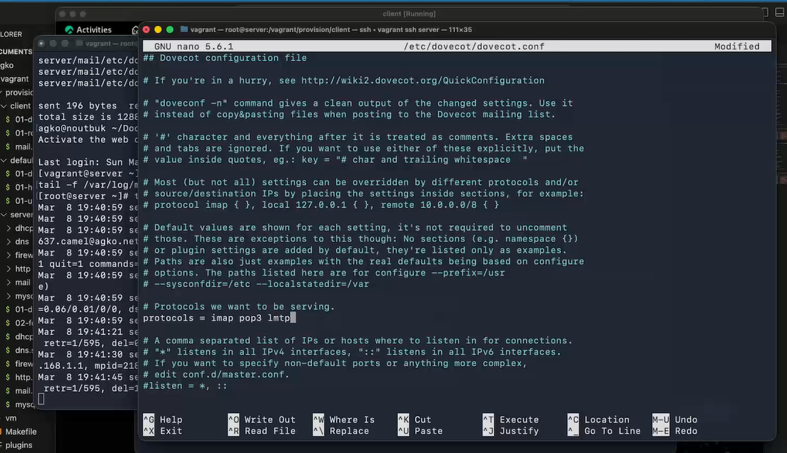{#fig:001 width=70%}

## Настройка LMTP в Dovecote

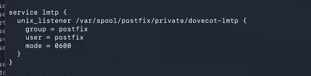{#fig:002 width=70%}

## Настройка LMTP в Dovecote

Переопределим в Postfix с помощью postconf передачу сообщений не на прямую, а через заданный unix-сокет с помощью команды:

```
postconf -e 'mailbox_transport = lmtp:unix:private/dovecot-lmtp'
```

## Настройка LMTP в Dovecote

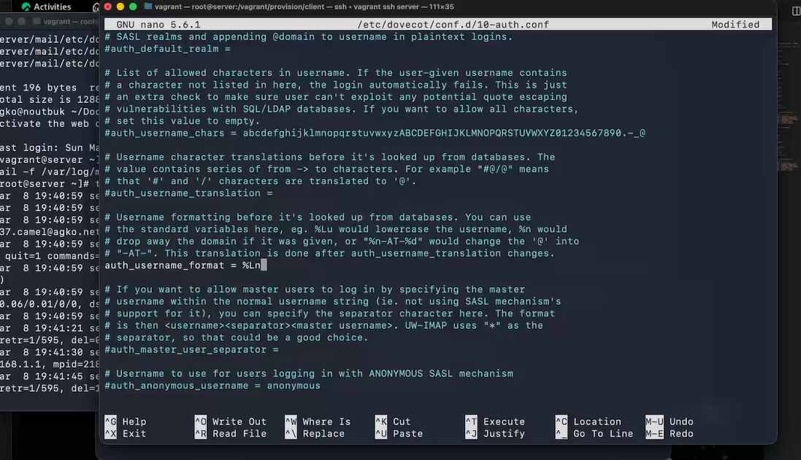{#fig:003 width=70%}

## Настройка LMTP в Dovecote

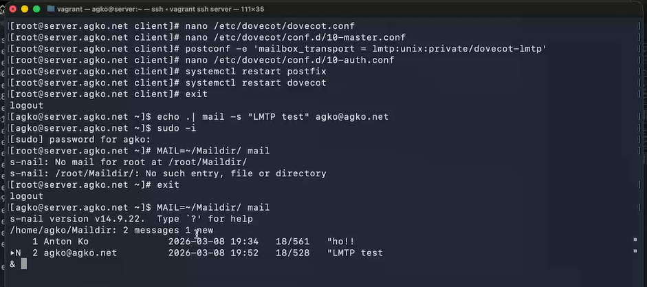{#fig:004 width=70%}

## Настройка LMTP в Dovecote

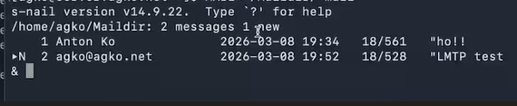{#fig:005 width=70%}

## Настройка SMTP-аутентификации

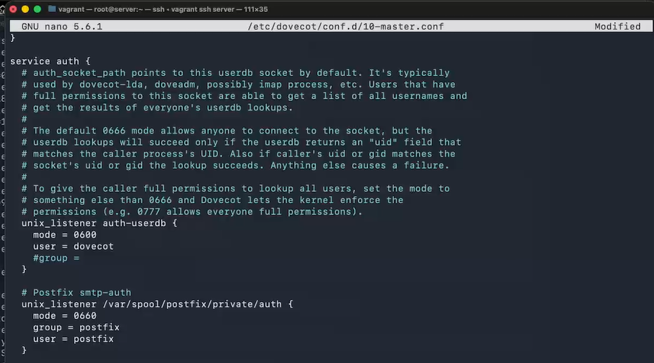{#fig:006 width=70%}

## Настройка SMTP-аутентификации

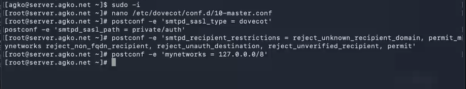{#fig:007 width=70%}

## Настройка SMTP-аутентификации

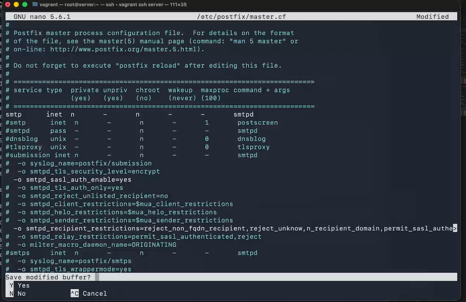{#fig:008 width=70%}

## Настройка SMTP-аутентификации

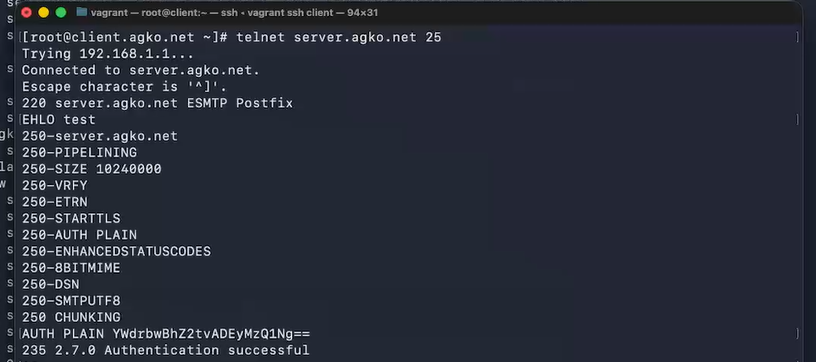{#fig:009 width=70%}

## Настройка SMTP over TLS

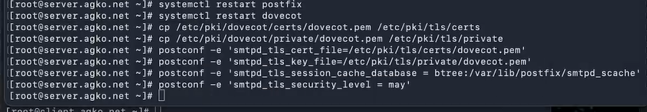{#fig:010 width=70%}

## Настройка SMTP over TLS

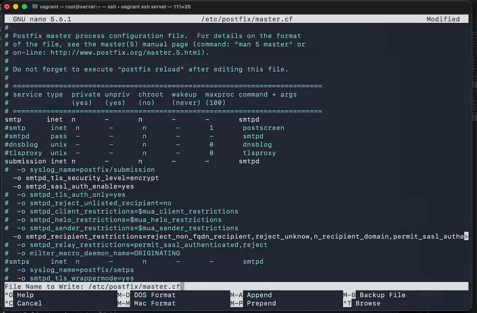{#fig:011 width=70%}

## Настройка SMTP over TLS

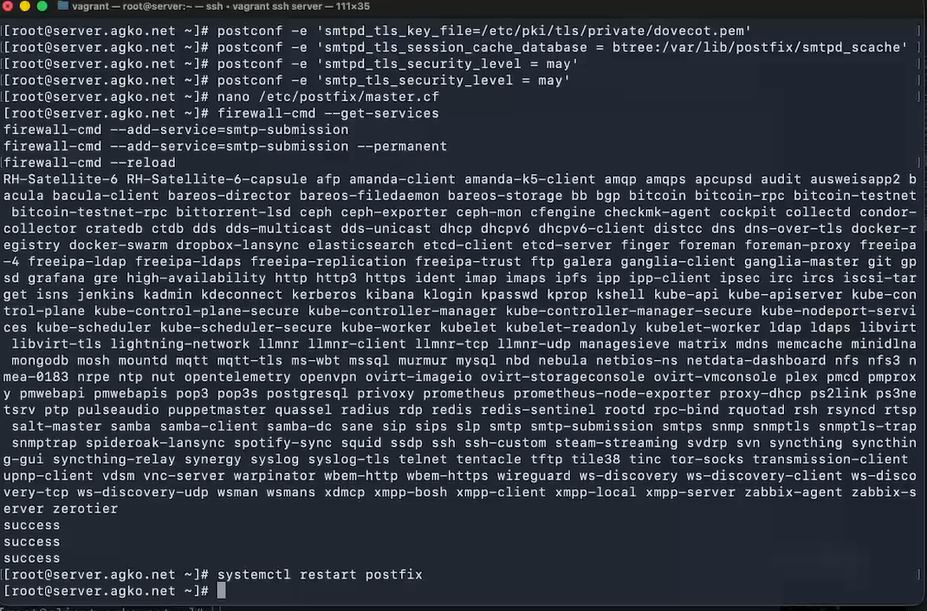{#fig:012 width=70%}

## Настройка SMTP over TLS

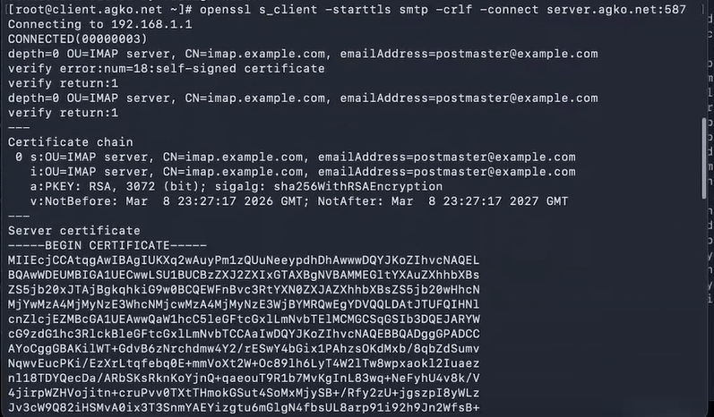{#fig:013 width=60%}

## Настройка SMTP over TLS

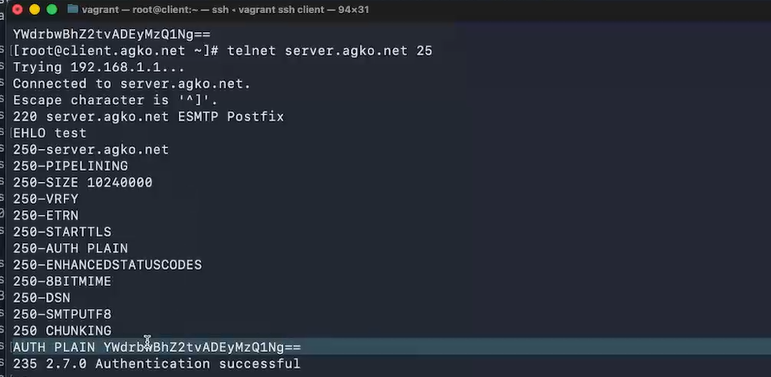{#fig:014 width=70%}

## Настройка SMTP over TLS

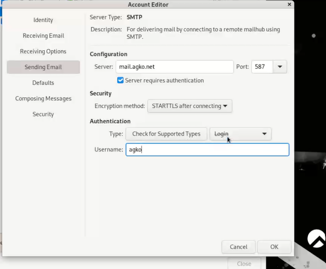{#fig:015 width=50%}

## Настройка SMTP over TLS

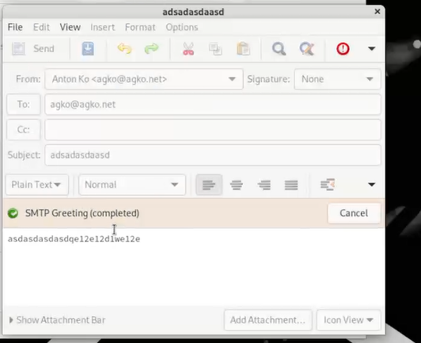{#fig:016 width=60%}

## Внесение изменений в настройки внутреннего окружения виртуальной машины

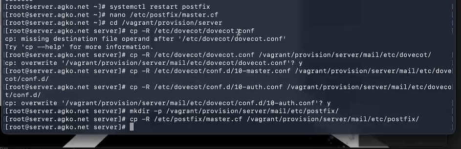{#fig:017 width=60%}

## Внесение изменений в настройки внутреннего окружения виртуальной машины

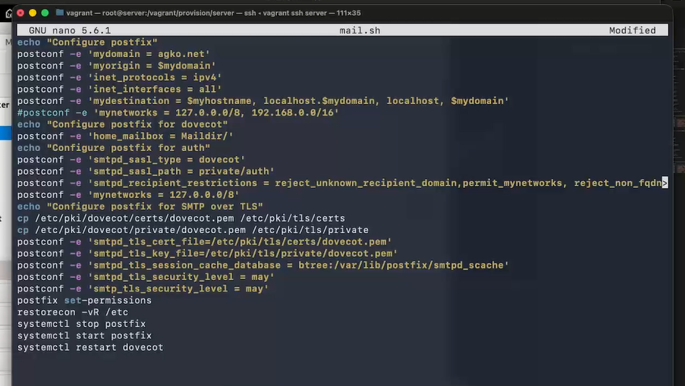{#fig:018 width=45%}

## Внесение изменений в настройки внутреннего окружения виртуальной машины

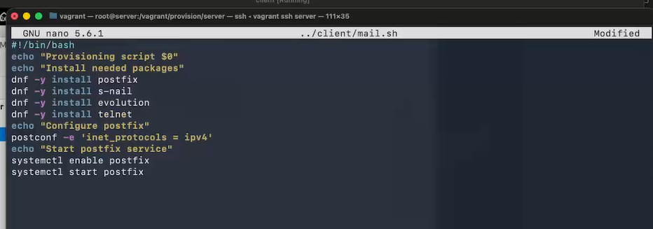{#fig:019 width=70%}

# Заключение

## Выводы

В результате выполнения данной работы были приобретены практические навыки по конфигурированию SMTP-сервера в части настройки аутентификации.