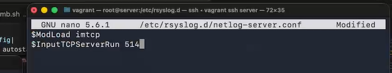
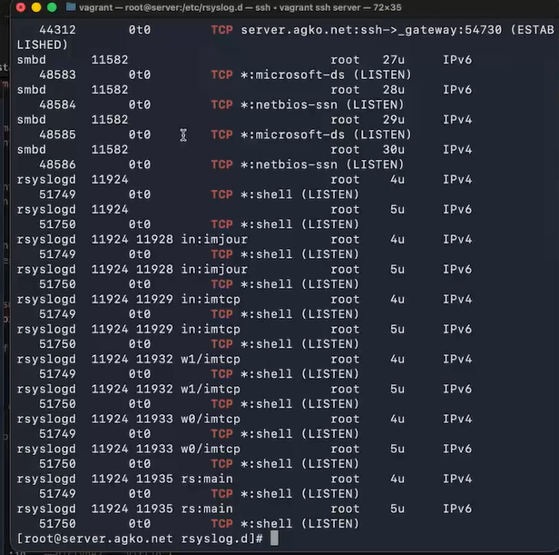
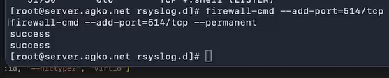
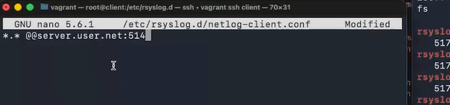
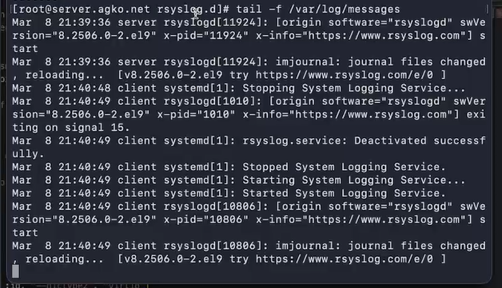
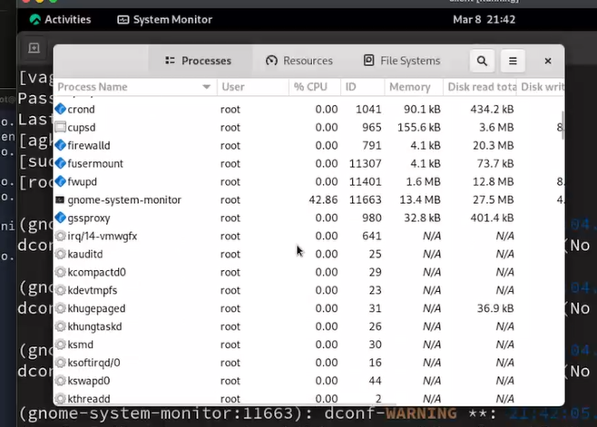
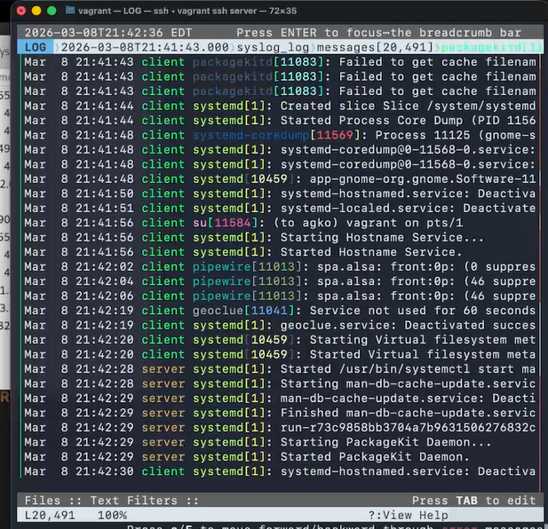
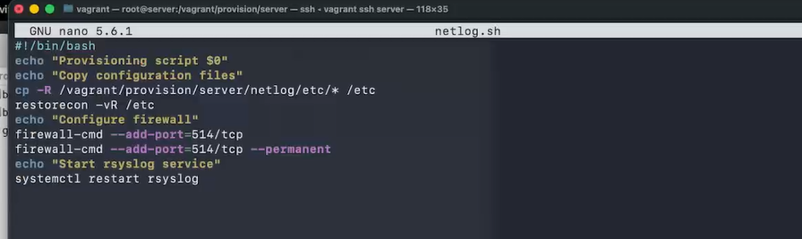
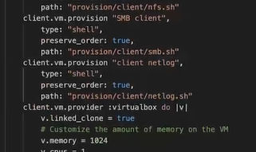

---
## Author
author:
  name: Ко Антон Геннадьевич
  degrees: DSc
  orcid: 0000-0002-0877-7063
  email: antonkosakh@gmail.com
  affiliation:
    - name: Российский университет дружбы народов
      country: Российская Федерация
      postal-code: 117198
      city: Москва
      address: ул. Миклухо-Маклая, д. 6
## Title
title: Лабораторная работа №15
subtitle: астройка сетевого журналирования
license: CC BY
date: today
date-format: "YYYY-MM-DD" # Example: 2026-03-08
---

# Информация

## Докладчик

:::::::::::::: {.columns align=center}
::: {.column width="70%"}

  * Ко Антон Геннадьевич
  * студент
  * Российский университет дружбы народов им. П. Лумумбы
  * [1132221551@rudn.ru](mailto:1132221551@rudn.ru)
  * <https://SenDerMen04.github.io/ru/>

:::
::: {.column width="30%"}


:::
::::::::::::::

# Вводная часть

## Цель работы

Получение навыков по работе с журналами системных событий.

## Задание

1. Настройте сервер сетевого журналирования событий.
2. Настройте клиент для передачи системных сообщений в сетевой журнал на сервере.
3. Просмотрите журналы системных событий с помощью нескольких программ. При наличии сообщений о некорректной работе сервисов исправьте
ошибки в настройках соответствующих служб.
4. Напишите скрипты для Vagrant, фиксирующие действия по установке и настройке сетевого сервера журналирования


# Выполнение лабораторной работы

## Настройка сервера сетевого журнала

На сервере создадим файл конфигурации сетевого хранения журналов:

```
cd /etc/rsyslog.d
touch netlog-server.conf
```

## Настройка сервера сетевого журнала

{#fig:001 width=70%}

## Настройка сервера сетевого журнала

{#fig:002 width=70%}

## Настройка сервера сетевого журнала



## Настройка клиента сетевого журнала

На клиенте создадим файл конфигурации сетевого хранения журналов:

```
cd /etc/rsyslog.d
touch netlog-client.conf
```

## Настройка клиента сетевого журнала

{#fig:004 width=70%}

## Настройка клиента сетевого журнала

```
systemctl restart rsyslog
```

## Просмотр журнала

{#fig:005 width=70%}

## Просмотр журнала

{#fig:006 width=60%}

## Просмотр журнала

```
dnf -y install lnav
```

## Просмотр журнала

{#fig:007 width=60%}

## Внесение изменений в настройки внутреннего окружения виртуальных машины

```
cd /vagrant/provision/server
mkdir -p /vagrant/provision/server/netlog/etc/rsyslog.d
cp -R /etc/rsyslog.d/netlog-server.conf /vagrant/provision/server/netlog/etc/rsyslog.d

touch netlog.sh
chmod +x netlog.sh
```

## Внесение изменений в настройки внутреннего окружения виртуальных машины

{#fig:008 width=70%}

## Внесение изменений в настройки внутреннего окружения виртуальных машины

```
cd /vagrant/provision//client
mkdir -p /vagrant/provision//client/netlog/etc/rsyslog.d
cp -R /etc/rsyslog.d/netlog-/client.conf /vagrant/provision//client/netlog/etc/rsyslog.d

touch netlog.sh
chmod +x netlog.sh
```

## Внесение изменений в настройки внутреннего окружения виртуальных машины

{#fig:009 width=70%}

## Внесение изменений в настройки внутреннего окружения виртуальных машины

```
server.vm.provision "server netlog",
  type: "shell",
  preserve_order: true,
  path: "provision/server/netlog.sh"
client.vm.provision "client netlog",
  type: "shell",
  preserve_order: true,
  path: "provision/client/netlog.sh"

```

# Заключение

## Выводы

В результате выполнения данной работы были приобретены практические навыки по работе с журналами системных событий.