---
## Author
author:
  name: Ко Антон Геннадьевич
  degrees: DSc
  orcid: 0000-0002-0877-7063
  email: antonkosakh@gmail.com
  affiliation:
    - name: Российский университет дружбы народов
      country: Российская Федерация
      postal-code: 117198
      city: Москва
      address: ул. Миклухо-Маклая, д. 6
## Title
title: Лабораторная работа №16
subtitle: Базовая защита от атак типа brute force
license: CC BY
date: today
date-format: "YYYY-MM-DD" # Example: 2026-03-08
---

# Информация

## Докладчик

:::::::::::::: {.columns align=center}
::: {.column width="70%"}

  * Ко Антон Геннадьевич
  * студент
  * Российский университет дружбы народов им. П. Лумумбы
  * [1132221551@rudn.ru](mailto:1132221551@rudn.ru)
  * <https://SenDerMen04.github.io/ru/>

:::
::: {.column width="30%"}


:::
::::::::::::::

# Вводная часть

## Цель работы

Получить навыки работы с программным средством Fail2ban для обеспечения базовой защиты от атак типа «brute force».

## Задание

1. Установите и настройте Fail2ban для отслеживания работы установленных на сервере служб.
2. Проверьте работу Fail2ban посредством попыток несанкционированного доступа с клиента на сервер через SSH.
3. Напишите скрипт для Vagrant, фиксирующий действия по установке и настройке Fail2ban.

# Выполнение лабораторной работы

## Защита с помощью Fail2ban

На сервере установим fail2ban:

```
dnf -y install fail2ban
```
Запустим сервер fail2ban:

```
systemctl start fail2ban
systemctl enable fail2ban
```

## Защита с помощью Fail2ban

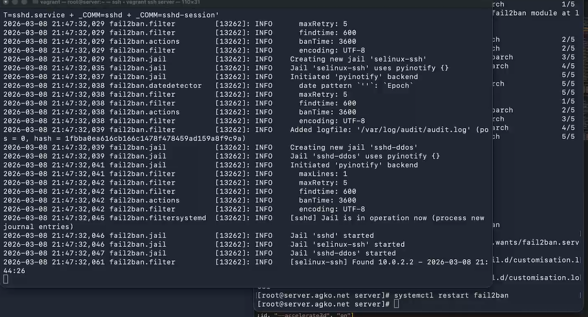{#fig:001 width=70%}

## Защита с помощью Fail2ban

```
touch /etc/fail2ban/jail.d/customisation.local
```

## Защита с помощью Fail2ban

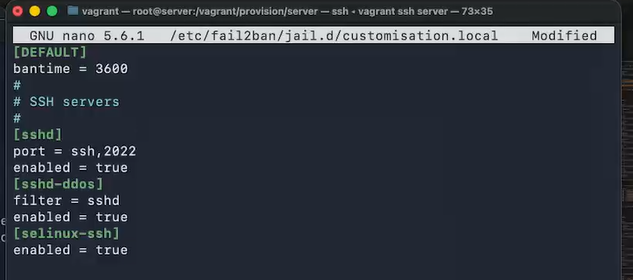{#fig:002 width=70%}

## Защита с помощью Fail2ban

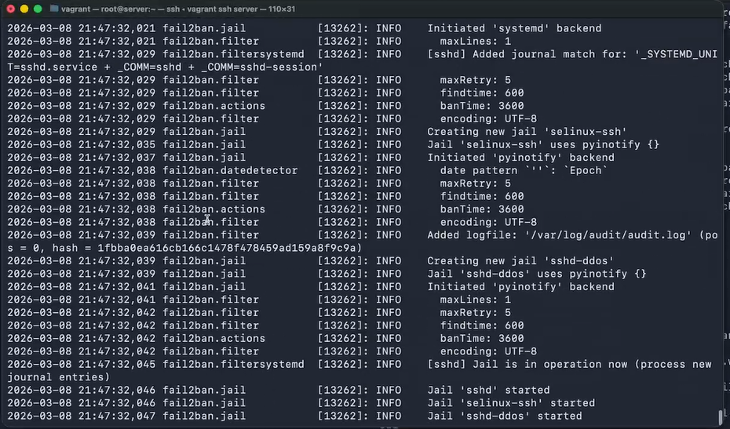{#fig:003 width=45%}

## Защита с помощью Fail2ban

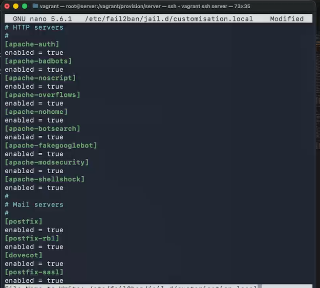{#fig:004 width=55%}

## Защита с помощью Fail2ban

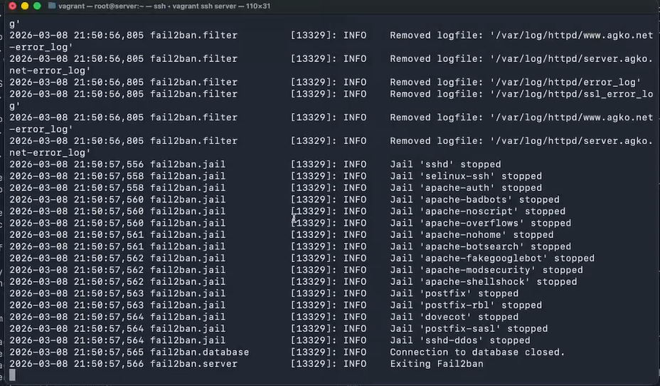{#fig:005 width=50%}

## Защита с помощью Fail2ban

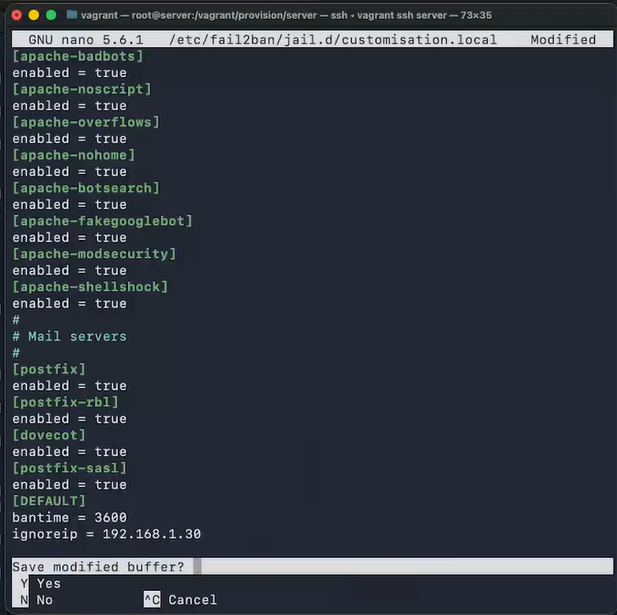{#fig:006 width=70%}

## Защита с помощью Fail2ban

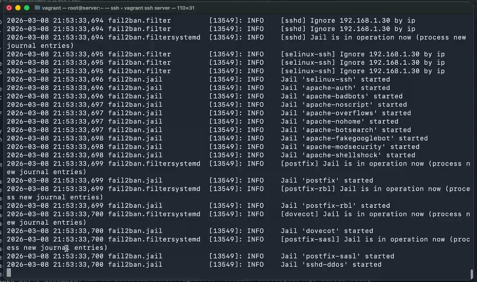{#fig:007 width=45%}

## Проверка работы Fail2ban

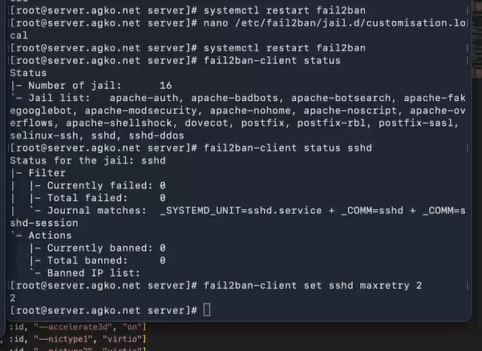{#fig:008 width=70%}

## Проверка работы Fail2ban

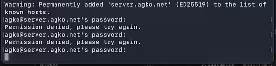{#fig:009 width=70%}

## Проверка работы Fail2ban

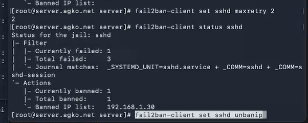{#fig:010 width=70%}

## Проверка работы Fail2ban

{#fig:011 width=70%}

## Проверка работы Fail2ban

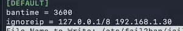{#fig:012 width=70%}

## Проверка работы Fail2ban

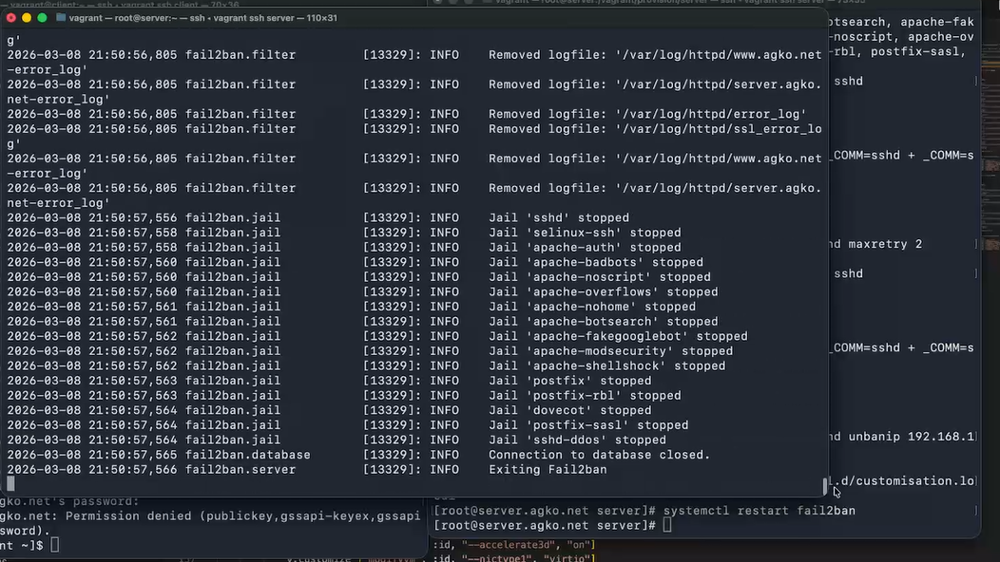{#fig:013 width=45%}

## Проверка работы Fail2ban

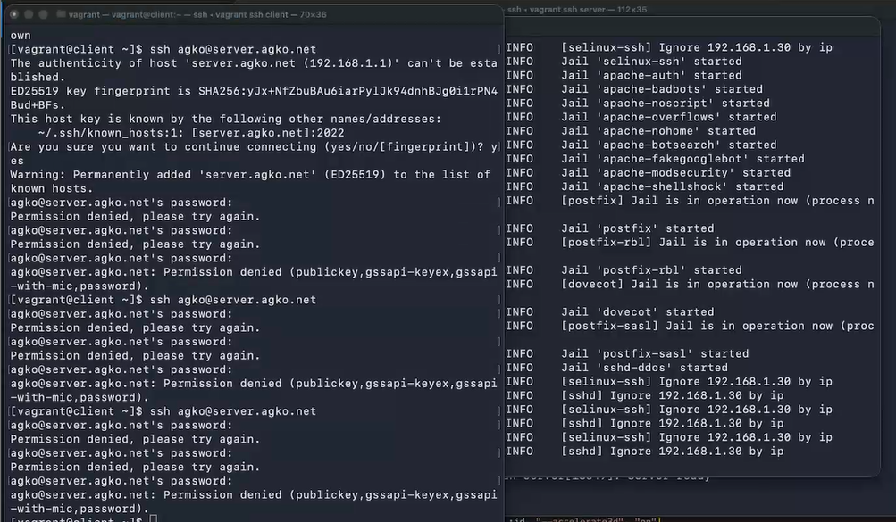{#fig:014 width=70%}

## Внесение изменений в настройки внутреннего окружения виртуальных машины

```
cd /vagrant/provision/server
mkdir -p /vagrant/provision/server/protect/etc/fail2ban/jail.d
cp -R /etc/fail2ban/jail.d/customisation.local 
/vagrant/provision/server/protect/etc/fail2ban/jail.d/

touch protect.sh
chmod +x protect.sh
```

## Внесение изменений в настройки внутреннего окружения виртуальных машины

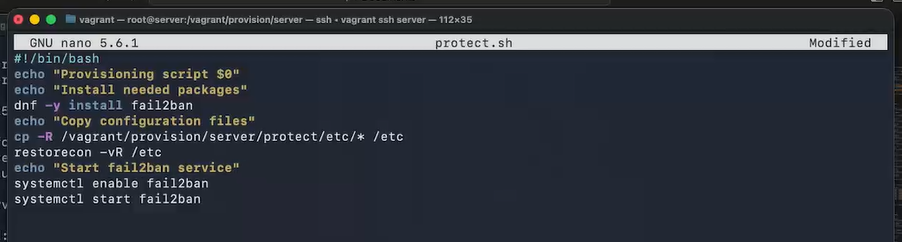{#fig:015 width=70%}

## Внесение изменений в настройки внутреннего окружения виртуальных машины

```
server.vm.provision "server protect",
  type: "shell",
  preserve_order: true,
  path: "provision/server/protect.sh"

```

# Заключение

## Выводы

В результате выполнения данной работы были приобретены практические навыки работы с программным средством Fail2ban для обеспечения базовой защиты от атак типа «brute force».